# About colour

Colour is an important part of our lives. Colours are symbolic. They stir emotions within us.

Think about the colours of the walls of your house. How would your living room look if the walls were painted

- white?
- black?
- magenta?

Therefore, colour is an integral part of a branding process. We will consider colour carefully as we select **colour palettes** for the website.

## Colour palettes

Your choice of colour palette is essential in the design of your website. Whatever decision you choose is likely to have to be used in the website for a long time. Can you imagine if Coca-Cola changed from its iconic red to blue? What would Pepsi have to say about that?

In terms of colours coordination, this means creating a visual structure consisting of base colours and contrasting them with accent complementary (or tertiary) colours.

Thus, on a website, we must think of at least four distinct colours:

- background
- base colour (i.e. the main colour of the website)
- accent colour
- text colour

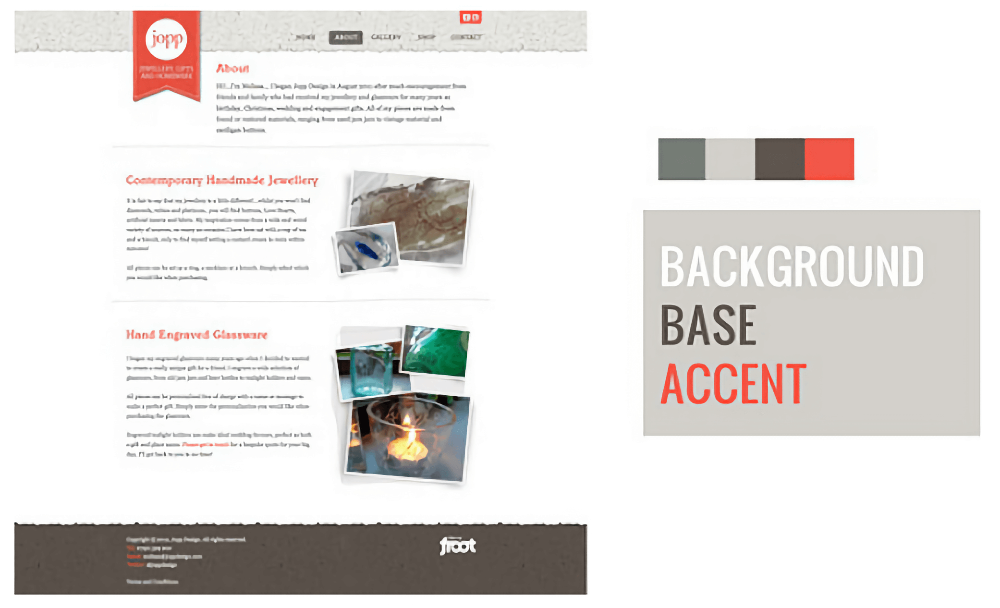

# How to create a colour palette

To create your colour palette, you will use a website called [Coolors](https://coolors.co).

[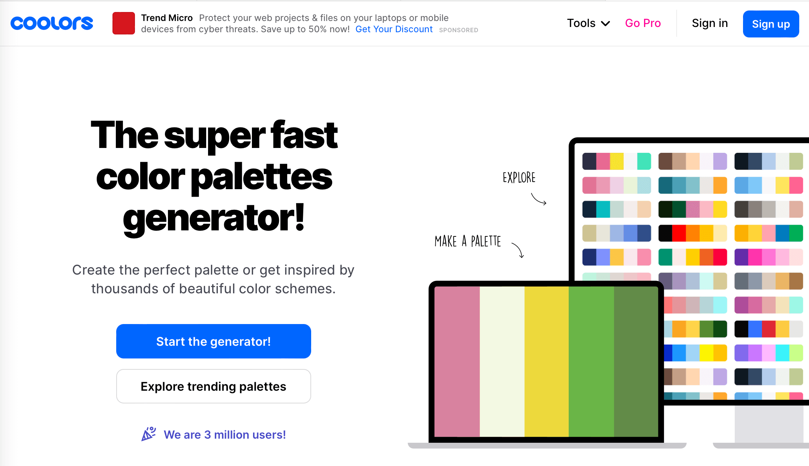](https://coolors.co)

This website allows you to browse colour palettes, generate your own, and export an image of the colour palette that you can use in your documentation.

You can either:

1. click on [Start the generator!](https://coolors.co/generate) and press Space Bar to cycle through a series of colours
2. manually choose a couple of your own colours, lock them in place, then press Space Bar to generate the rest
3. explore trending palettes to see what sorts of colours are used for various topics

The rest of the page will follow option 2.

## Choosing a primary base colour

The easiest place to start is with the base colour. This is the "main" colour of your website — when people come to the home page, this is the colour that sticks in their mind.

This is also the colour that people will associate with the brand of your website.

For example, what do you think the base colour of the following banks would be?

| Bank | Colour |
| :-- | :-- |
| **ANZ** |
| **ASB** |
| **Kiwibank** |
| **Westpac** |

To start with, think about the associations people make with certain colours. The Color Emotion Guide show the association between certain colours and various emotions.

[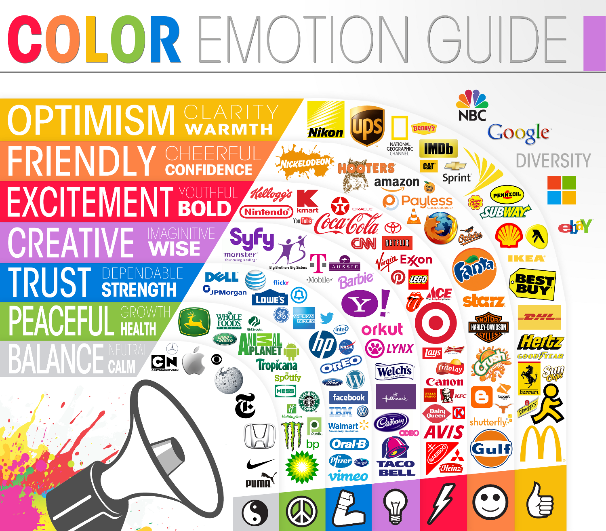](img/colours_emotion_guide.png)

| Colour | Association |
| :-- | :-- |
| Red | Excitement, youthful, bold |
| Orange | Friendly, cheerful, confidence |
| Yellow | Optimism, clarity, warmth |
| Green | Peaceful, growth, health |
| Blue | Trust, dependable, strength |
| Purple | Creative, imaginative, wise |
| Black & White | Balance, neutral, calm |

You will notice that brands wish to stir certain emotions in customers will use these colours — even if the association isn't always accurate (*is Cartoon Network really associated with calm?*).

Colour associations can also differ depending on culture and locale. You, or your end users, may associate certain colours with different emotions.

Choose a colour that reflects:

- the topic of the website
- the association you want your end users to feel with the website

In Coolors:

1. click on the hex code (i.e. ``0095FF``) at the bottom the **second** colour
2. using the colour picker, choose a **bold** version of the colour you wish to use

## Choosing a secondary base colour

Next, let's pick a version of the base colour that can be used for other purposes.

For example, if you use your primary base colour is used for headings or buttons, the secondary base colour could be used for subtle backgrounds, the navigation bar, etc.

In Coolors:

1. click on the hex code at the bottom of the **first** colour
2. type the hex code of the **second** colour into the box. Make sure the ``#`` symbol remains at the front
    - 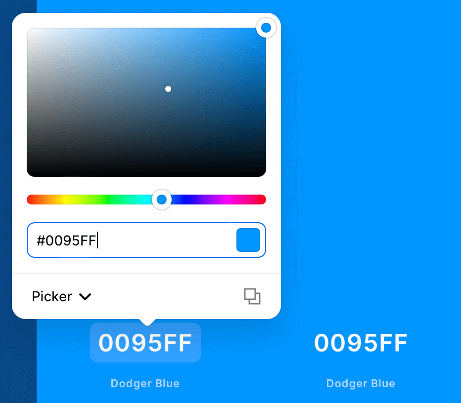
3. click on the View Shades button. It looks like a grid
    - 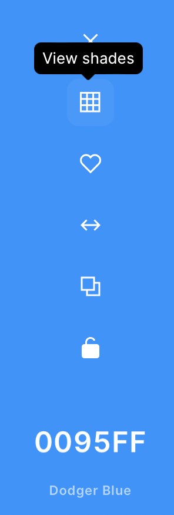
4. if you are making a light theme for your website, choose a lighter, less saturated version of the colour. Otherwise, choose a darker colour
5. Click on the padlock icon to lock the colours
    - 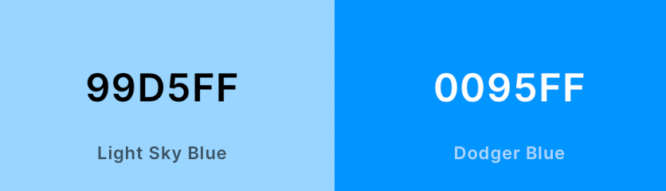

## Choosing an accent colour

An accent colour is used to highlight something on the page. For example:

- hyperlinks between pages
- buttons
- highlighting a selected item
- drawing attention to a picture or section of text

To select a suitable colour, you will use a web page called [Canva Color Wheel](https://www.canva.com/colors/color-wheel/).

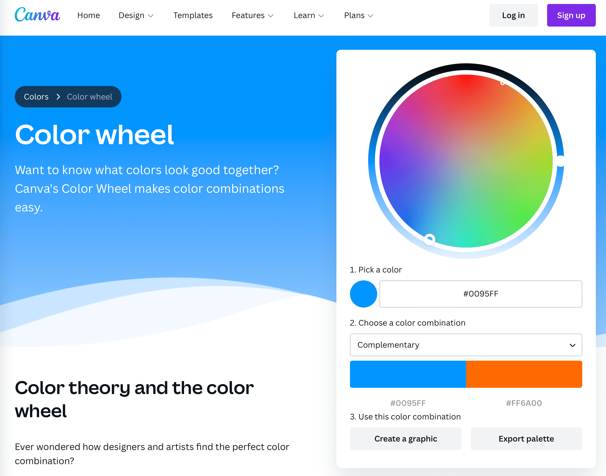

Canva uses **colour theory** to propose colours that work well together. For the web, there are two main types of colour combinations that can provide suitable accent colours:

- complementary
- triadic/tetradic

You can read about the colour theory on the Canva Color Wheel web page.

1. Copy your primary base colour's hex code from Coolors into Canva Color Wheel
2. Choose a colour combination
    - complementary
    - triadic
    - tetradic
3. Click on the colour on the right. The hex code will be copied
4. In Coolors, click on the hex code of the **third** and paste the new hex code
    - 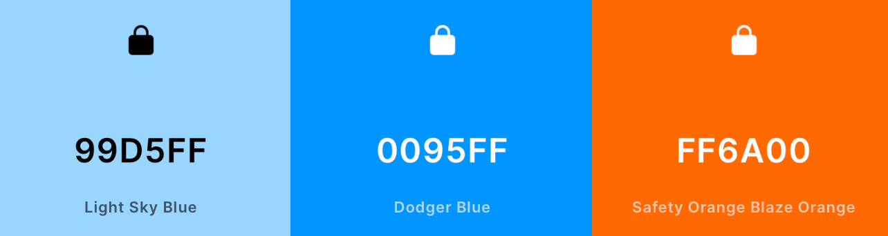
4. Click on the padlock icon to lock the colours

## Choosing text and background colours

Contrary to popular belief, you don't need to make text just black-on-white or white-on-black. You *can* make use of colour!

However, be careful to ensure that the combination of text and background colours remains **readable**. To do this, you will need to perform a contrast check.

Fortunately, Coolors has a tool for this: the [Contrast Checker](https://coolors.co/contrast-checker).

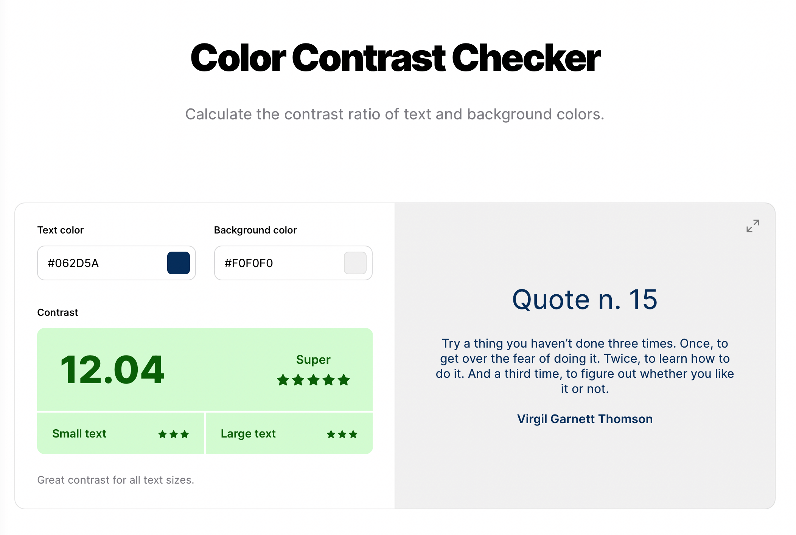

In the Contrast Checker:

1. select the text colour and background colour you plan to use
2. check the contrast ratings
    - ideally, you want a score of 12 or above
    - the more stars, the better the colours contrast — meaning, the easier the text will be to read

When you have found a good colour combination:

1. copy hex code for the text colour, then add it to your palette as the **fourth** colour
2. copy hex code for the text colour, then add it to your palette as the **fifth** colour

## Export the palette

At the top of the generator window, click Export, then click Save. You will download a file such as this, which you can then add to your portfolio.

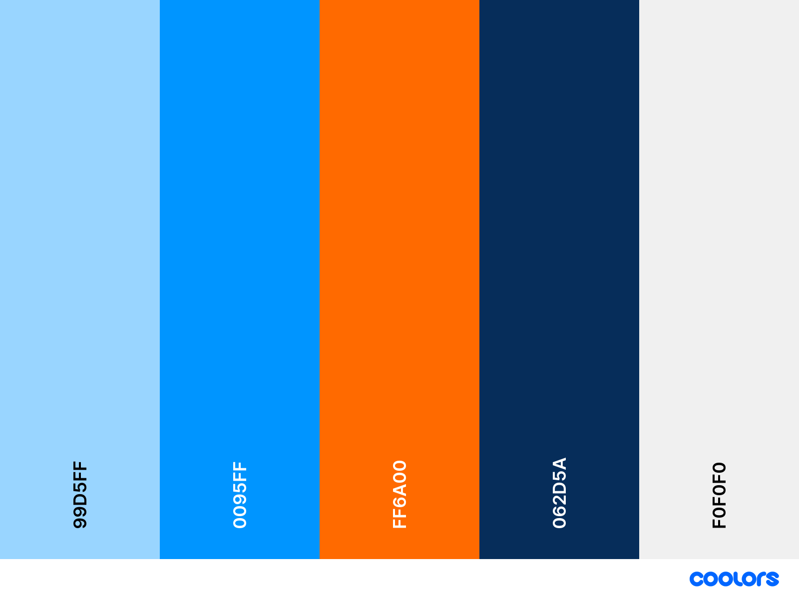

# Try the palette out

You can use the [Colour Tester](/classroom/colours.html) to try the colours with a sample web page. Click on the colour buttons to change the demo's colours, then take a screenshot and add it to your portfolio.

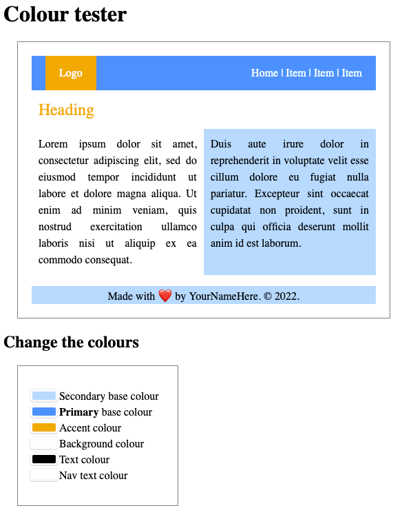

- Click on the colour box
    - If you use Chrome or Edge, click on the "RGB" button twice until it shows "HEX"
    - If you use Safari, click on "More Colours" → second icon → change the slider type to "RGB Sliders"
    - Firefox does not support entering hex codes on Windows, but it does on macOS
- Copy-paste the hex code from your colour palette
- Take a screenshot

Bear in mind, this is just a **demonstration** of the colours you have chosen. You may use the colours differently on your website — but this gives a "good enough" impression on how they could be used.

# Task

In the **Colours** section of your portfolio, discuss what colours you might use and why.

Generate **three** (3) palettes:

1. one light palette
2. one dark palette
3. another palette of your choice

In each, try different colours and combinations (complementary, triadic, tetradic, etc.).

Add the colours to your portfolio, and explain why you chose the palette.