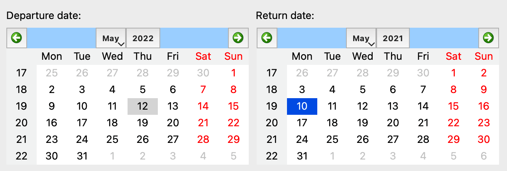
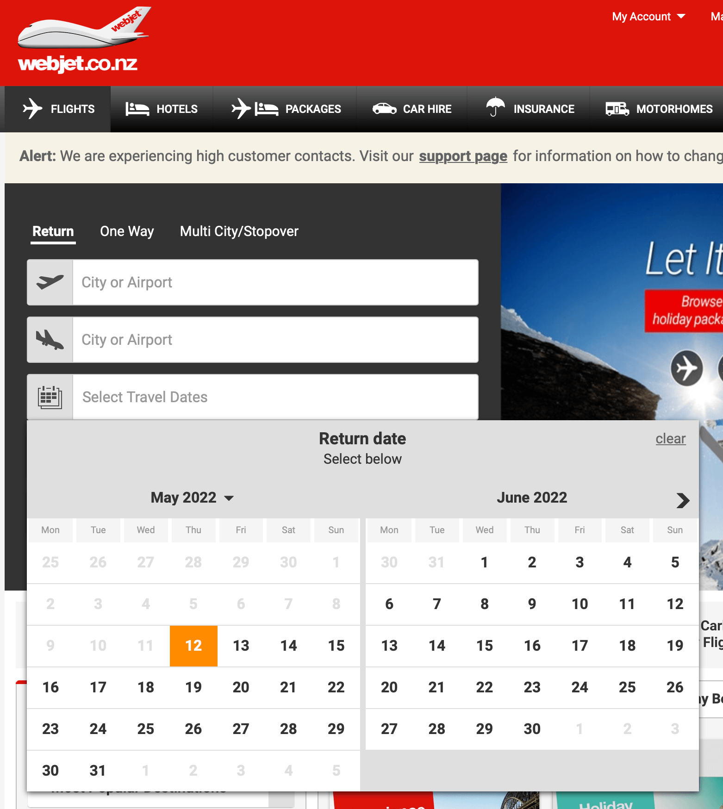
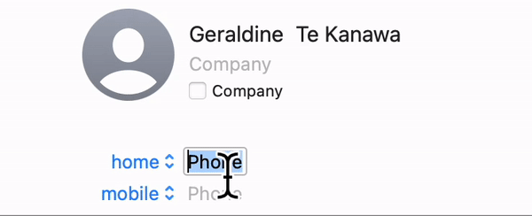
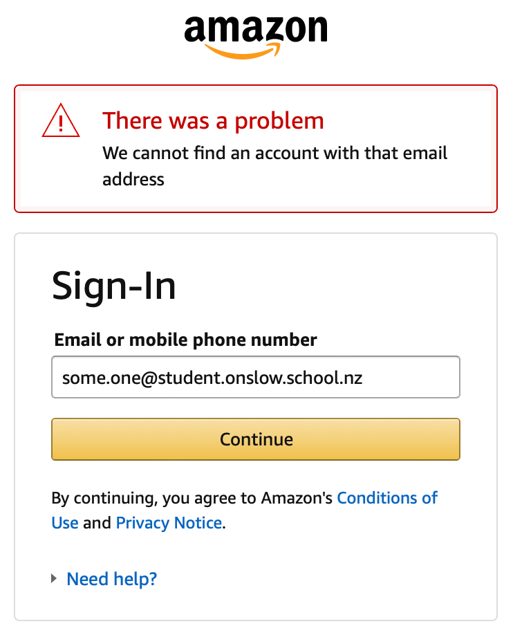
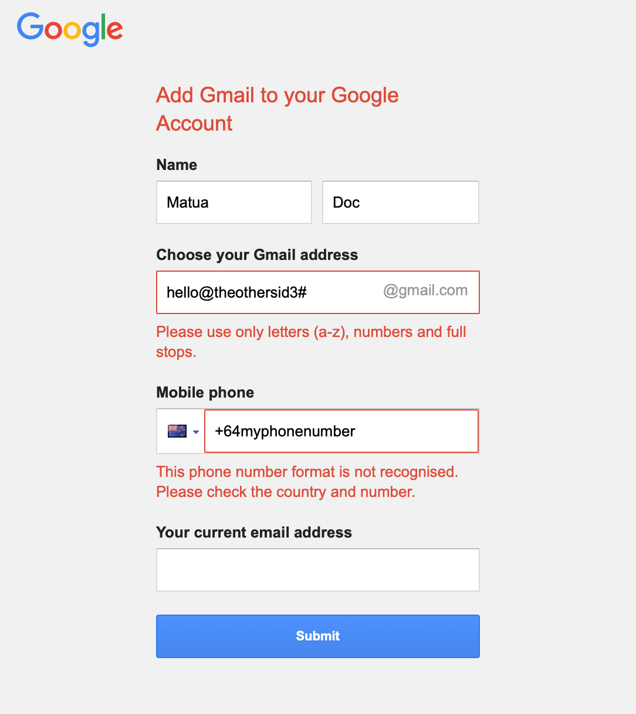
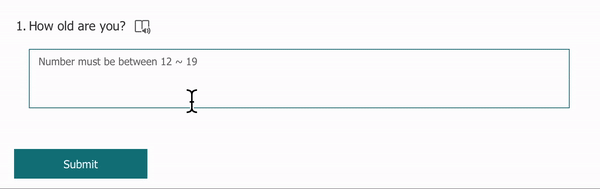
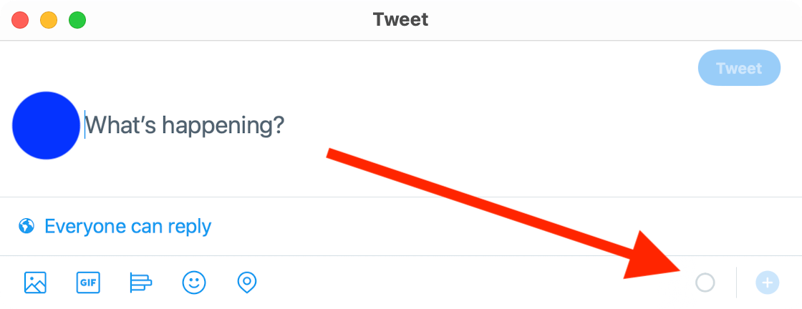
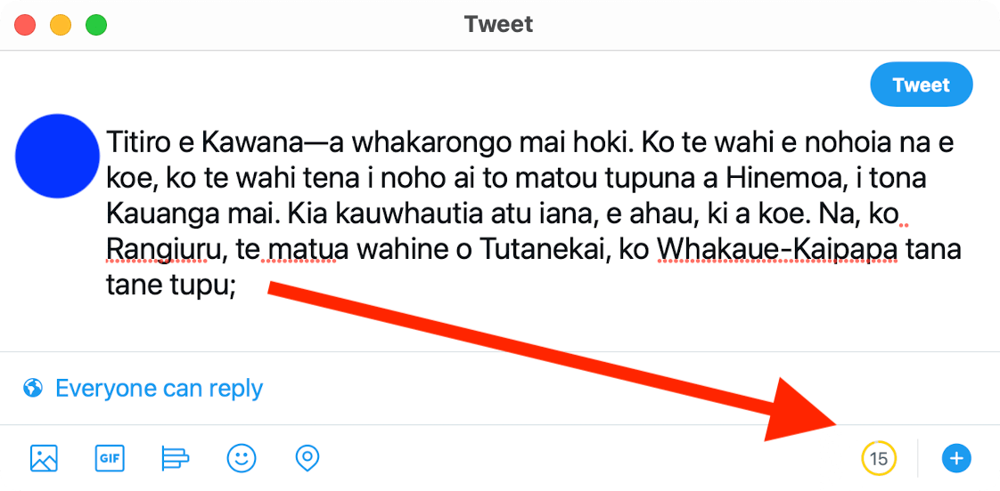
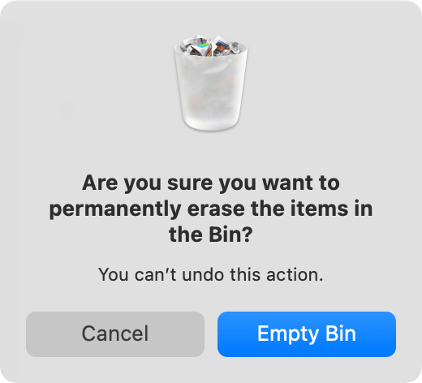
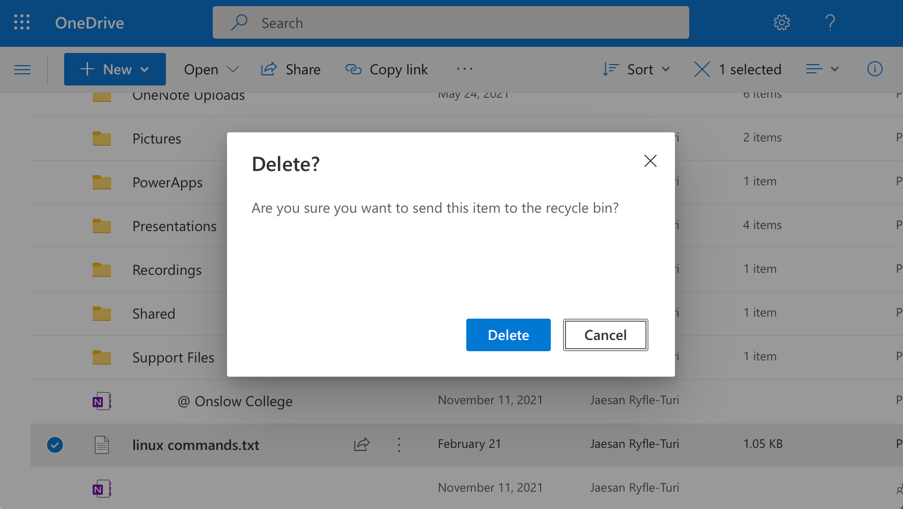

In technology, design refers to both **aesthetics** (how something looks) and **functionality** (how something works). You can't have one without the other.

In 1994, Jakob Nielsen came up with ten general principles for interaction design — how people **use** a technological outcome — called [10 Usability Heuristics for User Interface Design](https://www.nngroup.com/articles/ten-usability-heuristics/).

These are:

1. Visibilty of system status
2. Match between system and the real world
3. User control and freedom
4. Consistency and standards
5. **Error prevention**
6. Recognition rather than recall
7. Flexibility and efficiency of use
8. Aesthetic and minimalist design
9. **Help users recognise, diagnose, and recover from errors**
10. **Help and documentation**

This page is concerned with heuristics 5, 9, and 10.

# Error prevention

This heuristic relates to the fact that users will inevitably make errors when using the program. This could be for many reasons:

- the user is not tech savvy
- the user accidentally clicked or typed something they did not mean to
- the user did not understand what the user interface expected of them

Generally speaking, you can divide the sort of errors that a user makes into two categories:

- [Error prevention](#error-prevention)
  - [Slips](#slips)
  - [Activity 1](#activity-1)
  - [Activity 2](#activity-2)
  - [Activity 3](#activity-3)
  - [Mistakes](#mistakes)
  - [Activity 4](#activity-4)

## Slips

A slip is when a user does something by accident, such as typing ``i`` when they mean to type ``o``. Slips are typically the result of a user not fully paying attention to what they are doing.

Nevertheless, this is not always the user's fault; a user interface can ensure that the user is aware of their slips when they happen. Ideally, the interface could also prevent the slip from occurring in the first place.

One way to help prevent a slip is by using constraints. For example, consider the following calendar. Can you see what is wrong with what the user has entered?

Notice that the return date is set **before** the departure date (by a whole year!).

This is a slip: the user did not realise that the year was incorrect.

To make sure this slip doesn't happen, most travel websites use the following constraint: only allow the return date to be set to a date that is **after** the departure date.

Additionally, most websites also don't allow you to set a departure date that is in the past, such as the website below which doesn't allow clicking on a previous date.

Another way to prevent a slip is to automatically format data rather than expect the user to do it.

For example, when entering a telephone number into a contact form, the interface could automatically the number appropriately depending on whether it is a landline or a mobile number.

In Aotearoa, landline numbers typically start with a two-digit area code (in Wellington, it's ``04``) whereas mobile numbers start with a three-digit code (such as ``027``).

This allows the user to see that they have entered the number correctly. Otherwise, they might accidentally enter a landline number into a field meant for a mobile number, or vice versa.

## Activity 1

Use the [Chorus Broadband Checker](https://www.chorus.co.nz/tools-support/broadband-tools/broadband-checker) to see what kinds of internet connections are available at your home.

1. What type of information do you need to add?
2. How does the interface prevent you from slipping up and entering invalid information?

**Note:** don't take a screenshot of your home address!

## Activity 2

Look at the following screenshot.

1. What slip is being prevented by the interface?
2. Why is it important to prevent the user from making this slip?

1. What slip**s** (more than one) are being prevented by the interface?
2. Why would it be important to prevent the user from making these slips?

## Activity 3

Take a look at the following GIF. It shows a form being filled in:

1. How is the user informed of the restrictions *before* using the interface?
2. How does the user know if they have made a mistake?
3. How does the user know if they have entered the correct information?

## Mistakes

On the other hand, mistakes happen when a user does not understand what the interface requires. This may be because:

- their understanding of what the interface requires is based on incorrect assumptions
- the interface does not correspond to their [expectations](expectations.md)
- the user's goals differ from what the interface is designed to do, but they don't know that

Though mistakes aren't purposeful, they are *conscious* — unlike slips, they are a result of the user's mental model of the task not matching what the task requires.

One way to prevent users from making mistakes is to make it clear from the beginning what the limitations are as they use the interface.

For example, in the screenshot below, a user might be typing in a long tweet on [Twitter](https://twitter.com/). To begin with, there is a small circular icon to indicate that more characters may be typed.

As more characters are added, the indicator changes colour and text appears that shows how many characters are left before hitting the maximum of 240.

After the user has exceeded 240 characters, the counter turns red and shows how many characters the user must delete and the text that exceeds the limit is highlighted with the red background. Also, the "Tweet" button is disabled until the extra characters are removed.

Another way to prevent errors from making mistakes is to warn before any changes will be made to user data, especially destructive actions.

An action can be described as "destructive" if it will cause information to be changed or deleted. For example, deleting files would be considered destructive.

Therefore, most operating systems will warn you before files are deleted. Some websites will also warn you about this.

| macOS | Outlook |
| :-: | :-: |
|  |  |

## Activity 4

Take a look at these screenshots and identify what mistakes are being prevented:

| | What problem could happen | How does the interface prevent it? |
| :-: | :-- | :-- |
|  |
|  |
|  |