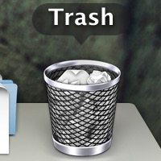
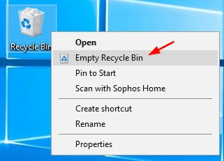
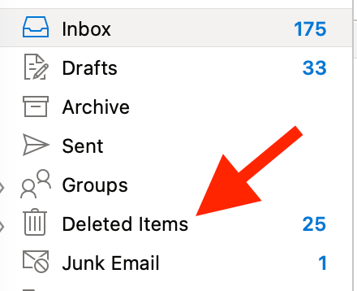
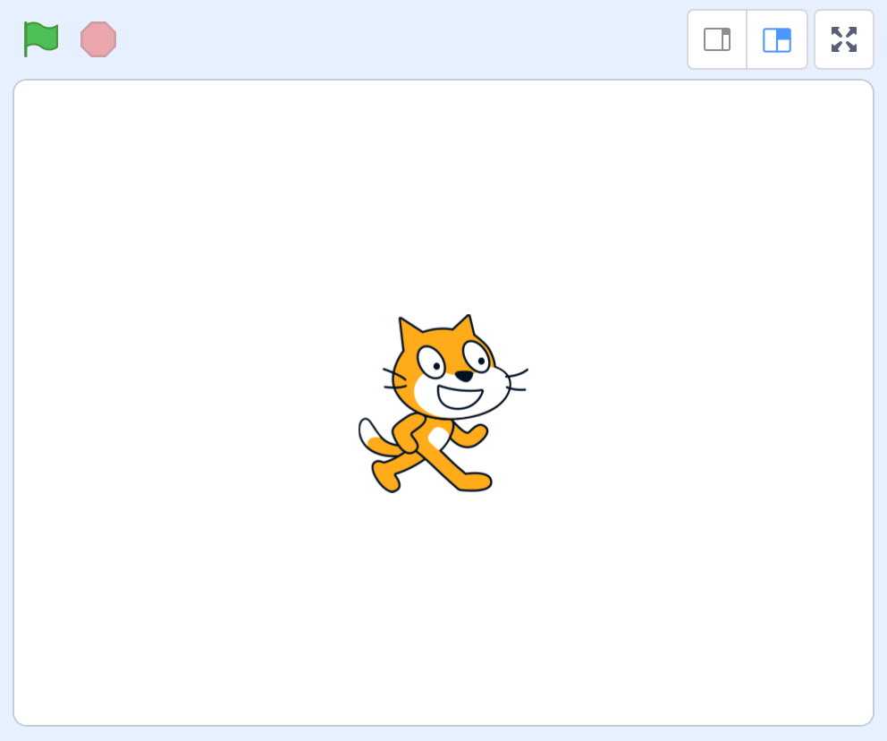
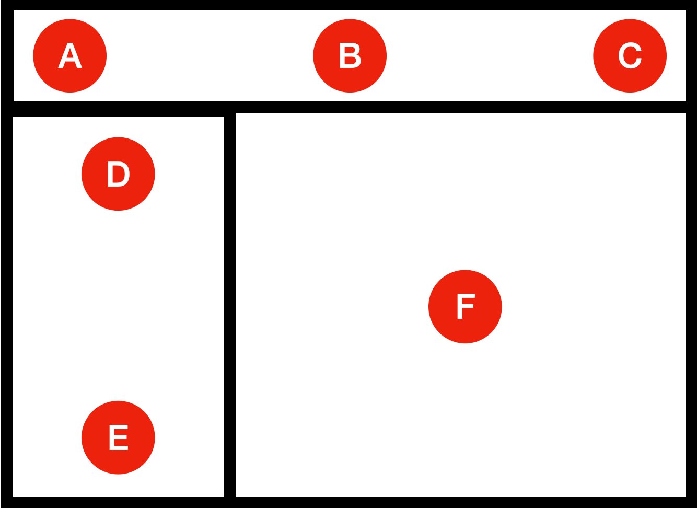
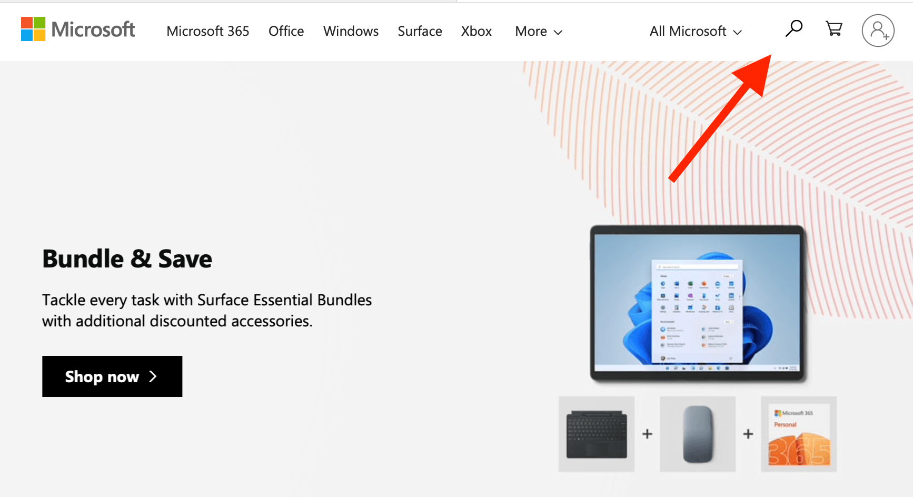
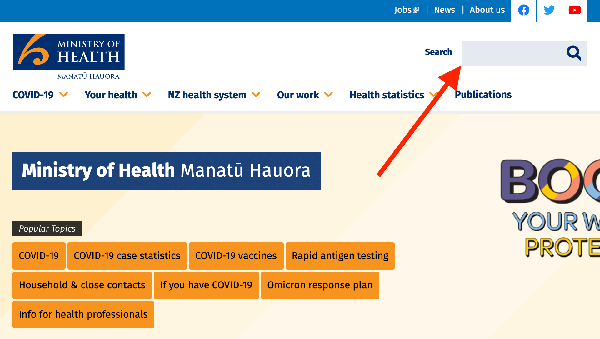

In technology, design refers to both **aesthetics** (how something looks) and **functionality** (how something works). You can't have one without the other.

In 1994, Jakob Nielsen came up with ten general principles for interaction design — how people **use** a technological outcome — called [10 Usability Heuristics for User Interface Design](https://www.nngroup.com/articles/ten-usability-heuristics/).

These are:

1. Visibilty of system status
2. **Match between system and the real world**
3. User control and freedom
4. **Consistency and standards**
5. Error prevention
6. Recognition rather than recall
7. Flexibility and efficiency of use
8. Aesthetic and minimalist design
9. Help users recognise, diagnose, and recover from errors
10. Help and documentation

This page is concerned with heuristics 2 and 4.

# Match between system and real world

This heuristic relates to how the computer's interface relates to what people already know from the real world. By using things that people already know and understand, the interface becomes more easily understood at first glance.

For example, which of the following error messages makes more sense to you?

| Error #1 | Error #2 |
| :-- | :-- |
| ``PC LOAD LETTER`` | ``Load Tray 1 with Letter-sized Paper`` |

[``PC LOAD LETTER``](https://en.wikipedia.org/wiki/PC_LOAD_LETTER) is infamous in technology as an unhelpful jargon term. It stands for “load letter-sized paper into the paper cassette” — but unless you know what PC and LOAD LETTER means, it’s not easy to understand.

On the other hand, the second message is more helpful. It states, with clear instructions, to load the tray with plain paper. Perhaps “Letter” is still not clear but the user can still use this instruction to resolve their problem much more easily.

**The words that a user interface chooses should be familiar so that they can be more easily understood.**

----

## Activity 1

For each of the pairs below, write down what you think is the most appropriate term. Then, write down what you think each command is asking you to do:
	
1. -
    - Compress the files to save space
    - Use a tarball to reduce disk consumption
2. -
    - Navigate to the installation directory
    - Open the Program Files folder
3. -
    - Remove superfluous on-screen symbolic links
    - Delete unnecessary shortcuts from the desktop

## Activity 2

The terms below are computer jargon. Research what the more familiar, user-friendly terms for each could be:
	
1. Home directory
2. USB Mass Storage
3. Pointing device

----

Furthermore, a user interface can show a match between the system and real world through its choice of iconography. This relates to the images used to perform a task.

This is especially useful for abstract concepts. For example, deleting a file is an abstract concept — there's not literally something that you file spits out into a rubbish bin.

Yet, most operating systems represent the deletion of files with the following icons:

| macOS | Windows | Outlook |
| :-: | :-: | :-: |
|  |  |  |

If you have used a computer in the last thirty years, you will know that you can put a file in the bin, then empty the bin to remove it permanently. On the other hand, you can also retrieve a file *from* the bin.

This is a metaphor — doing something on the computer is likened to something in the real world.

----

## Activity 3

Can you think of any more metaphors for the following computer operations?
	
Take a screenshot of an icon that represents the metaphors below:
	
1. Saving a file
2. Attaching a file to an email
3. Making the background behind some text bright yellow

## Activity 4

What computing tasks do the following icons typically represent in an interface?

1. 🔍
2. ⏳
3. ❤️

## Activity 5

Look at the following screenshots and identify **two** (2) metaphors used in each website:

1. -
2. -

3. -
4. -

# Consistency and standards

This heuristic is about making sure that the interface is consistent with the user's expectations of *other* user interfaces.

There are two types of consistency:

- **external**: does the program or website use the same design elements as other programs/websites?
- **internal**: does the program or website use the same design elements within its *own* interfaces?

Let's start with **external** consistency.

If users are accustomed to certain elements being located in certain places, using certain icons, or certain wording, ideally an interface would generally try to stick to what users already know.

This helps to reduce confusion and makes things easier to understand at a glance.

For example, in what part of a program or website do you usually find the search bar? A, B, C, D, E, F, or G?

Typically, you would expect to find the search bar in B or C. Let's look at some other websites and interfaces that confirm this.

| Microsoft | Amazon | health.govt.nz |
| :-: | :-: | :-: |
|  |  |  |

----

## Activity 6

1. Take screenshots of **five** (5) different websites and show where the navigation (the links to different parts of the website).
    - Top
    - Bottom
    - Left
    - Right
2. Which is most common?

----

Another way that an interface can achieved external consistency is in the styling of basic controls, such as buttons, check boxes, etc.

A button on a website should look like a button in a program — generally, a rounded rectangle with text in the middle.

The screenshot below contains a typical form layout, containing text boxes, a drop down menu, a list, a checkbox, and a button.

----

## Activity 7

Fill in the table describing the basic look and feel of each control in the screenshot above.

| Control | Shape | Features | What happens when you click on it |
| :-- | :-- | :-- | :-- |
| Checkbox (I accept) | square | tick box | the tick box hides and shows |
| Radio buttons (gender) |
| Spin box (age)
| Drop down menu (country) |
| List (profession) |
| Button (OK) |

## Activity 8

Take screenshots of any **six** (6) websites showing an example of the following controls:

- button
- list (where you can select one item)
- radio buttons
- spin box
- checkboxes

## Activity 9

The following website does **not** conform to consistency and standards **ON PURPOSE**! See how long it takes for you to get through the website.

Take a screenshot of you reaching the end of the task.

[Click here to open User Inyerface](https://userinyerface.com)