# About fonts

Font can communicate a lot about a webpage. The fonts that you choose for your site will give your viewers and impression of what you are like before they have even read your text.

Look at the fonts on webpages:

| Screenshot | Description |
| :-: | :-- |
| [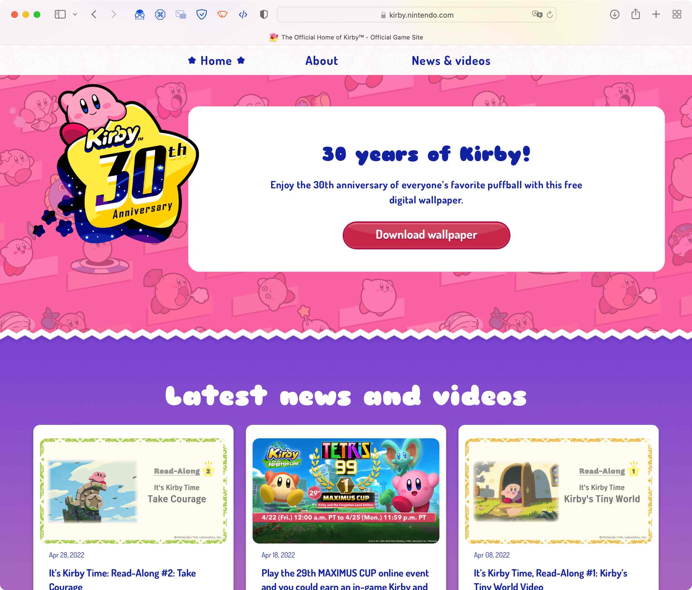](img/fonts_kirby.jpg) | Friendly, bubbly, round fonts that match the child-like aspects of the series |
| [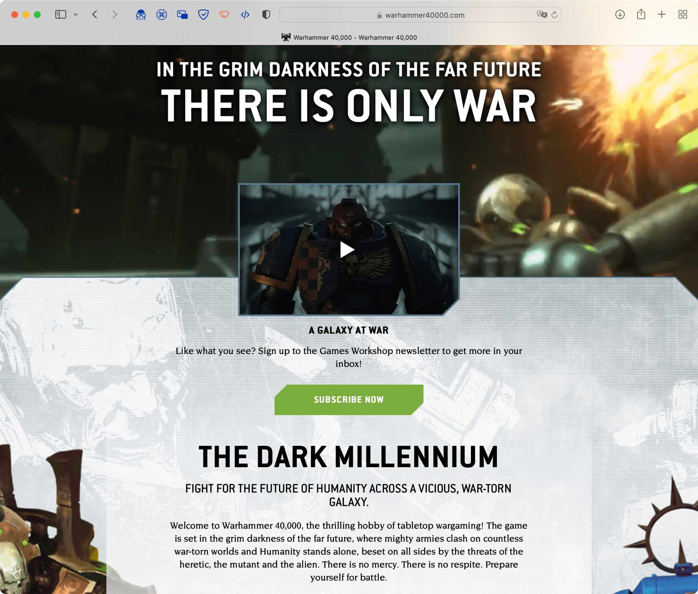](img/fonts_warhammer.jpg) | Serious, straight-edged, bold fonts for a more adult, gaming-oriented audience |
| [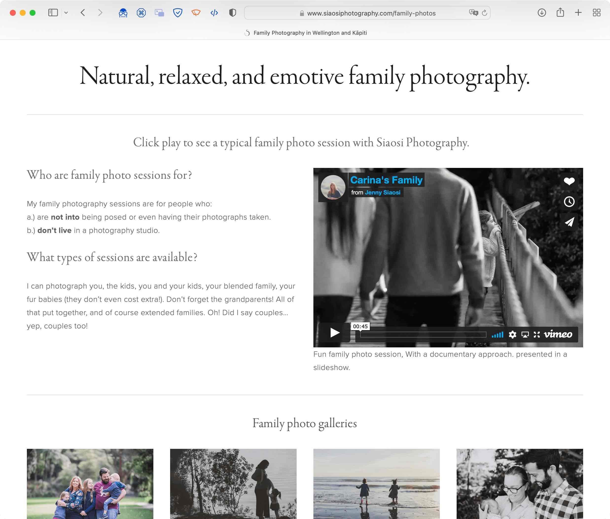](img/fonts_siaosi.jpg) | Muted, old-fashioned fonts that evoke a calm, professional quality |

# Text levels

On your page, there will be *at least* three (3) levels of text. Levels describe the size and purpose of the font within a document.

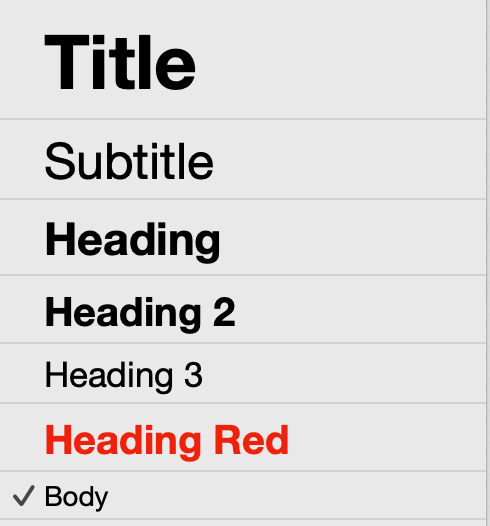

## Titles

To begin with, you will need a font for your website's **title**. This is one of the first fonts that a user will see when they see the website so you should carefully consider the [associations](#font-psychology) that font may have.

The heading font may not be used for the site title but for article titles. In that case, it may be the same as the [heading font](#headings), but in a larger size or bolder.

Title fonts are usually shown in a large size but sometimes are shown in a similar size to the rest of the web page. Check how large the website titles are on the websites you researched.

## Headings

Heading fonts are used to make it clear that a user is looking at a different section of a website. They usually come before paragraphs of text or when the subject is changed.

These fonts can also be used for emphasis, such as a pull quote — repeating some text from a paragraph to draw the reader's attention — and will therefore be shown in a larger size.

## Body text

This is the font used for most of the website. The navigation items, most paragraphs, and links will usually use this font. Because it is typically displayed smaller, it is important that the body font is legible (easy to read) at small font sizes.

# Font psychology

Just like colours, certain fonts, or types of fonts, are associated with certain feelings. This comes from their use in other media, such as print, television, and advertising.

## Serif fonts

Serifs are the little flicks at the ends of fonts such as Times, Palatino, Garamond.

Serif fonts imply **tradition**, **heritage**, **respectability**, and **reliability**.

This is likely due to their age, going back to the early days of the printing press, meaning that they have spent a lot of time in public view.

In fact, the name of the font Times New Roman comes from the its use as the typeface (print version of a font) for the Times newspaper in London.

Serif fonts can be further divided into three types:

- **Old style**: mostly similar thicknesses all around each character, strongly associated with long-form print such as newspapers and books
- **Modern**: thin horizontal lines and thick vertical lines, strong associated with fashion and magazines
- **Slab**: thick serifs, typically with a blocky shape, strongly associated with headings, advertising, and even the "Wild West"

| Old style | Modern | Slab |
| :-: | :-: | :-: |
|  | [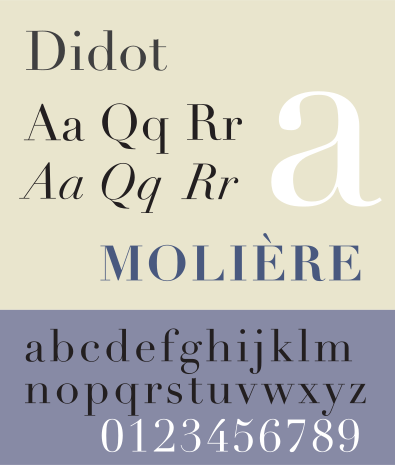](https://en.wikipedia.org/wiki/Didot_(typeface)) | [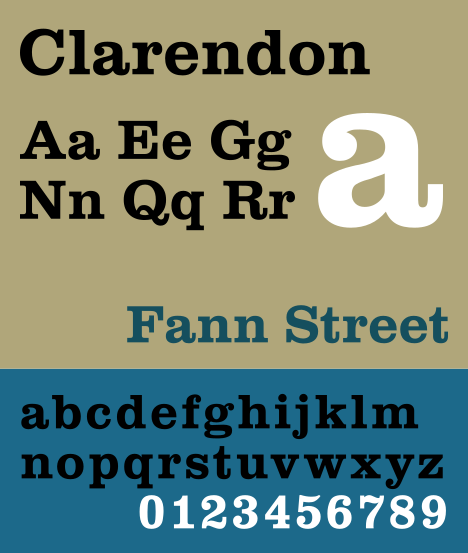](https://en.wikipedia.org/wiki/Clarendon_(typeface)) |
| [Times New Roman](https://en.wikipedia.org/wiki/Times_New_Roman) | [Didot](https://en.wikipedia.org/wiki/Didot_(typeface)) | [Clarendon](https://en.wikipedia.org/wiki/Clarendon_(typeface)) |

## Sans-serif

A more recent innovation, sans-serif fonts lack the serif (from the French *sans*, meaning 'without') in most letters.

Their development also coincides with a push towards simplicity, modernity, and minimalism. Therefore, these fonts are more strongly associated with the modern day.

Yet, their use dates back further than you might think. Typography without serifs is attested as far back as the 18th century. The suggestion of modernity dates from around the 1950s, when sans-serif fonts were typically used in print for advertising new post-WWII products.

Sans-serif fonts can be further divided into three types:

- **Grotesk** and **Neo-Grotesk**: a German term derived from the Italian *grottesco* meaning 'belonging in a cave', in reference to how inferior they seemed to the more ornate serif designs of the 19th century, these fonts tend to have fairly uniform widths. These are strongly associated with minimalism and modernity
- **Geometric**: based on geometric shapes such as complete circles or having pointed endings, strongly associated with the 1920s and 1930s, art, and design. Typically, they imply more personality than (Neo-)Grotesk fonts
- **Humanist**: these retain the lack of serifs but return to a focus on legibility (how easy they are to read), directly inspired by serif fonts that came before them. Strongly associated with computing since they form the basis of many user interface and body fonts

| (Neo-)Grotesk | Geometric | Humanist |
| :-: | :-: | :-: |
| ) | ) | ) |
| [Helvetica](https://en.wikipedia.org/wiki/Frutiger_(typeface)) | [Futura](https://en.wikipedia.org/wiki/Futura_(typeface)) | [Frutiger](https://en.wikipedia.org/wiki/Frutiger_(typeface)) |

## Other types

Of course, there are many types of fonts, and those are just a sampling of the most common types. There are also:

| Calligraphic | Brush script | Casual |
| :-: | :-: | :-: |
|  | [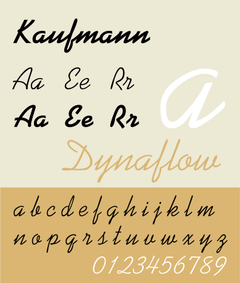](https://en.wikipedia.org/wiki/Kaufmann_(typeface)) | [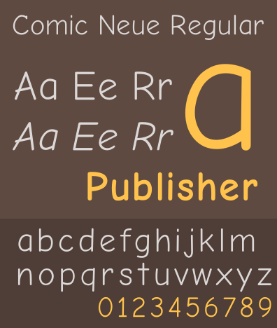](https://en.wikipedia.org/wiki/Comic_Neue) |
| [Kuenstler Script](https://en.wikipedia.org/wiki/Kuenstler_Script) | [Kaufmann](https://en.wikipedia.org/wiki/Kaufmann_(typeface)) | [Comic Neue](https://en.wikipedia.org/wiki/Comic_Neue) |

| Display | Monospace | Blackletter |
| :-: | :-: | :-: |
| [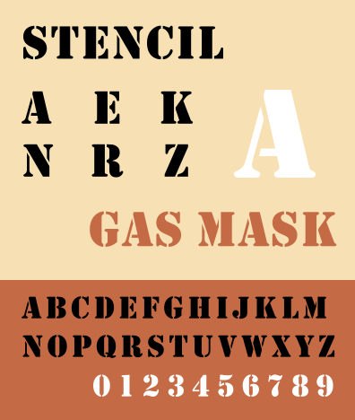](https://en.wikipedia.org/wiki/Stencil_(typeface)) | [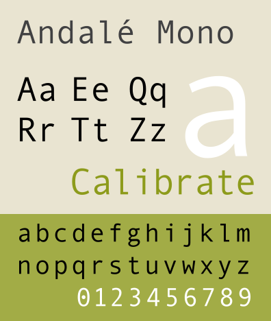](https://en.wikipedia.org/wiki/Andalé_Mono) | ) |
| [Stencil](https://en.wikipedia.org/wiki/Stencil_(typeface)) | [Andalé Mono](https://en.wikipedia.org/wiki/Andalé_Mono) | [Bastard](https://en.wikipedia.org/wiki/Bastard_(typeface)) |

# How to create a font pairing

To create your font pairs, you will use a website called [Fontjoy](https://fontjoy.com).

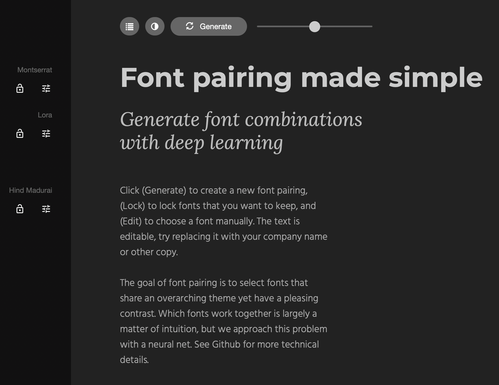

You can use Fontjoy to come up with combinations of fonts that look interesting.

To use Fontjoy:

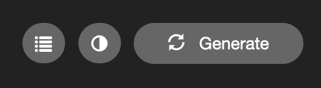

- generate font pairings using the **Generate** button. The choices of fonts depends on the similarity slider
    - 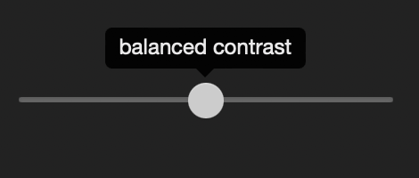
    - the further left the slider's knob, the more the fonts will differ from each other
    - the further right the slider's knob, the more the fonts will be similar to each other
- manually select a font using the font selection buttons on the left-side. If you lock any fonts with the padlock buttons, those fonts won't change when you press the Generate button
    - 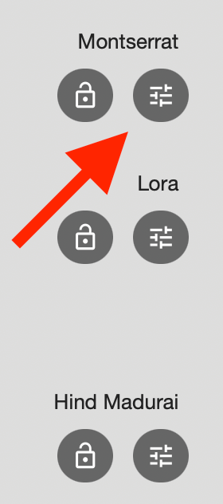
- switch between light and dark mode using the light/dark toggle on the toolbar
    - you must show screenshots of your fonts in both light mode and dark mode in the portfolio

## What to consider when choosing a font

Aside from the emotions that a font stirs up, you must also consider the font's **size**, **weight**, and style. These affect not only how the font is perceived but also users' expectations.

Additionally, they also affect legibility (how easy it is to read the font) which is an accessibility issue.

## Font size

You will already be familiar with the font sizes from editing documents in Word, Excel, etc.

There are standards relating to font size.

12 pt is considered standard for a body font. Therefore, headings will tend to be larger (between 14 pt to 18 pt, sometimes higher).

If you decide to have a larger body font size, remember that your heading font sizes should increase as well.

Fonts smaller than 12 pt may be hard for some users to read or less legible when there is poor colour contrast between the text and the background.

## Font weight

Font weight refers to the thinness or thickness of the font. You will be familiar with the difference between normal and **bold** text.

There are many more weights than just these two. This depends on the font. For example, [Avenir Next](https://en.wikipedia.org/wiki/Avenir_(typeface)#Avenir_Next) supports weights ranging from ultra light (very thin lines) to heavy (very thick lines).

On the web, font weights may be described by a number value rather than a word. These numbers range from ``1`` (very thin lines) to ``1000`` (very thick lines). A weight of ``400`` is considered normal, whilst ``900`` is bold.

Users typically expect bold text for headings or when an action needs to be undertaken, such as a button or link.

## Font style

Finally, a font may be altered through the use of styles and decorations, including:

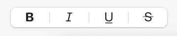

- *italics* (slanted text)
- <u>underlined text</u>
- ~~strikethrough~~ text (line through the middle)
- Small caps (lower-case letters are replaced by small upper-case letters of roughly th esame size)

On the web, <u style="color: blue">blue underlined text</u> is the default styling for hyperlinks that take the user around a website.

# Task

For each font pairing you create, you will select fonts for each of the three levels:

1. **title** font: for the title of the website and/or accent text
2. **heading** font: for the headings of each section and/or accent text
3. **body** font: for regular paragraphs

You will create **three** (3) font pairings:

1. a font pairing with a sans-serif title, serif heading, and sans-serif body font
2. a font pairing with a serif title, sans-serif heading, and serif body font
3. a font pairing with any combination — this could include all the same font!

Add light mode **AND** dark mode screenshots of the font pairings to your portfolio.

| Light | Dark |
| :-: | :-: |
| 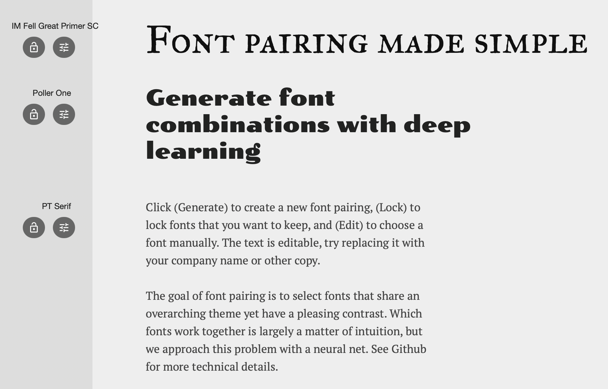 | 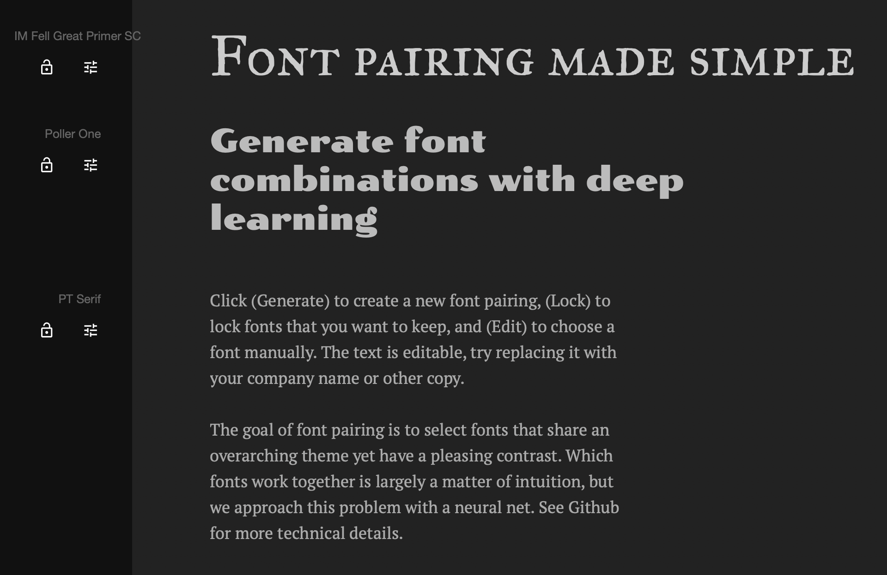 |