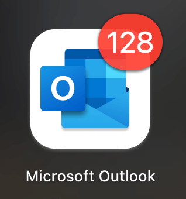
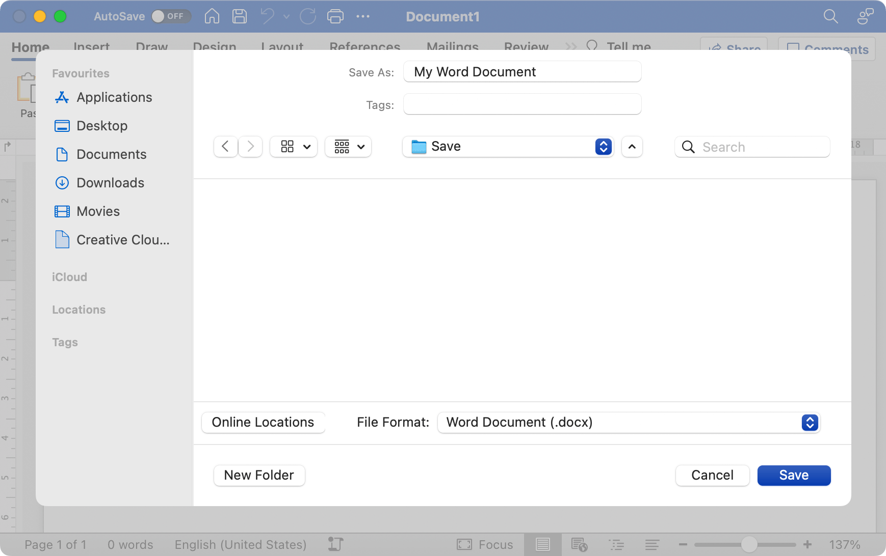
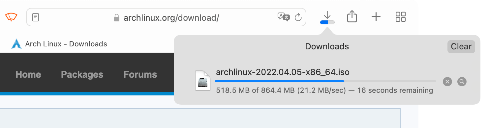
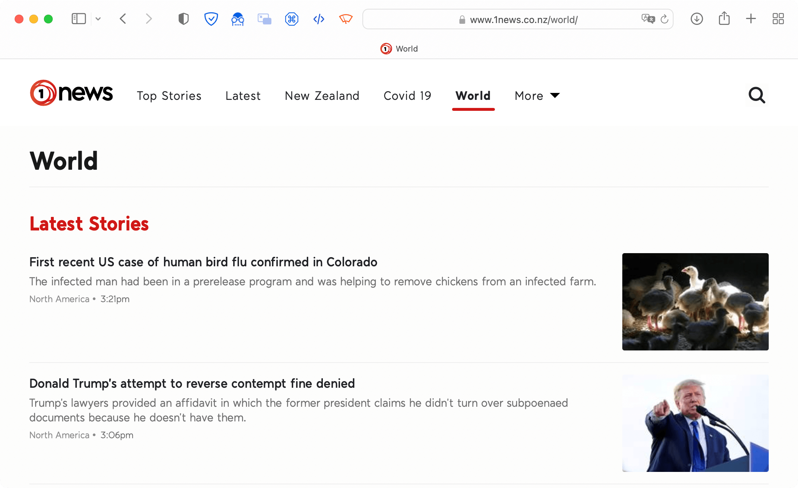
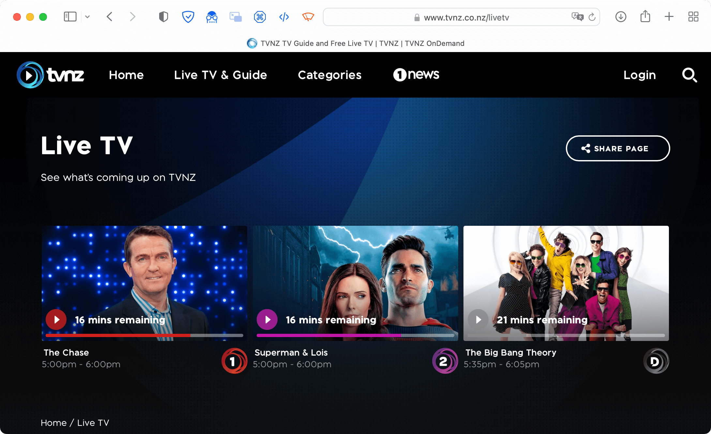
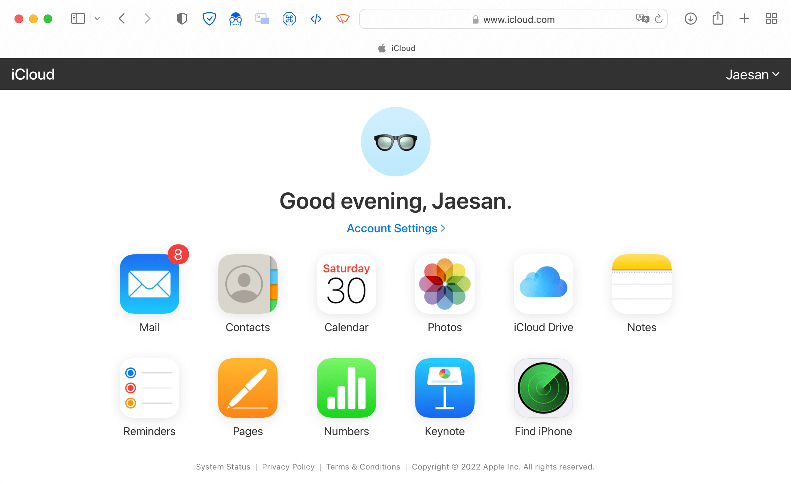
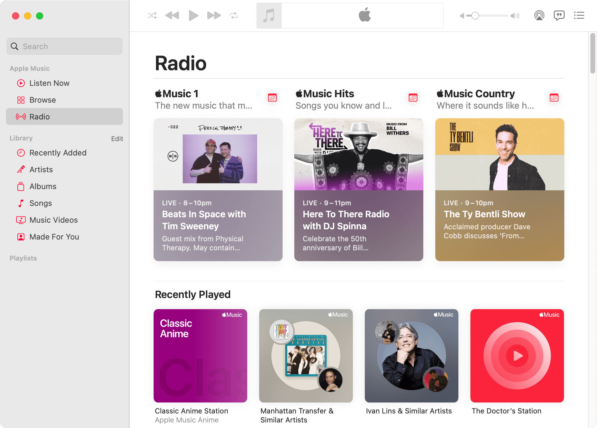
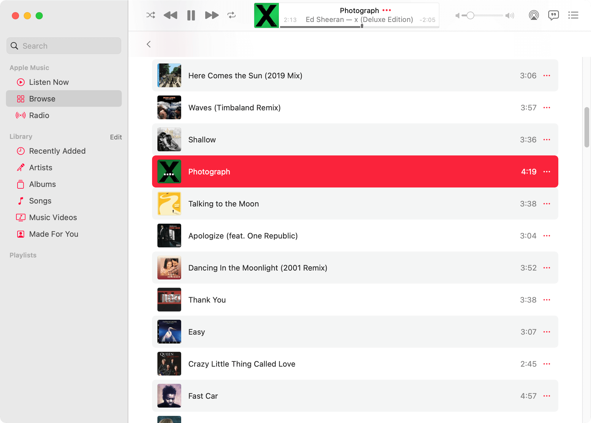
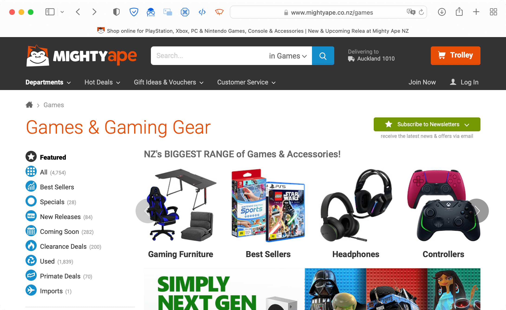
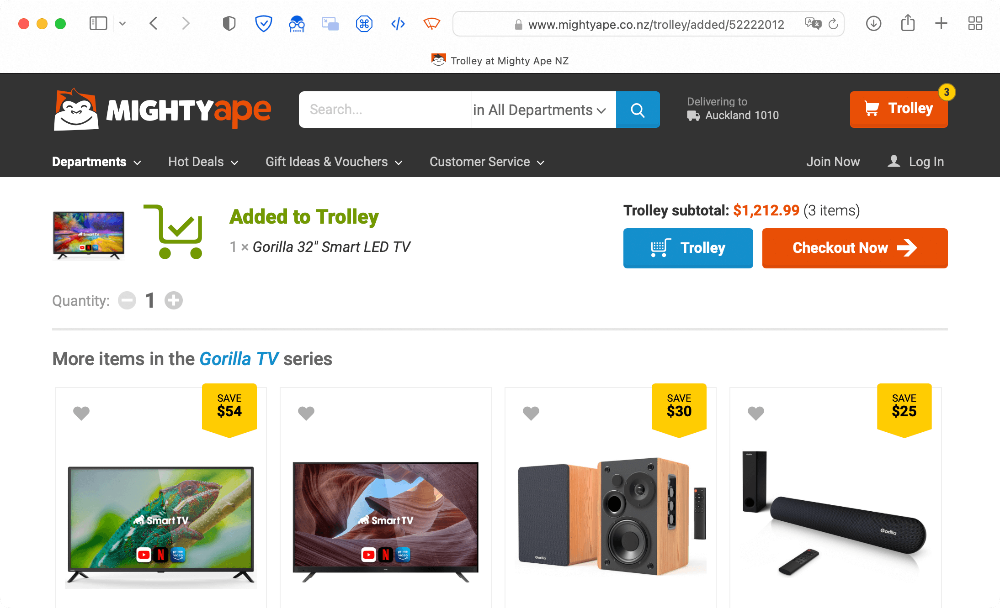

In technology, design refers to both **aesthetics** (how something looks) and **functionality** (how something works). You can't have one without the other.

In 1994, Jakob Nielsen came up with ten general principles for interaction design — how people **use** a technological outcome — called [10 Usability Heuristics for User Interface Design](https://www.nngroup.com/articles/ten-usability-heuristics/).

These are:

1. Visibilty of system status
2. Match between system and the real world
3. User control and freedom
4. Consistency and standards
5. Error prevention
6. Recognition rather than recall
7. Flexibility and efficiency of use
8. Aesthetic and minimalist design
9. Help users recognise, diagnose, and recover from errors
10. Help and documentation

This page is concerned with heuristics 1 and 3.

# Visibility of system status

> The system should always keep users informed about what is going on, through appropriate feedback within reasonable time.

This heuristic describes the way that a user should always understand where in the program or website they are and/or what is happening. For the feedback to be delivered within a "reasonable time", it should let the user know what's happening when it is most relevant — usually immediately!

There are many ways that something can show its status. For example, a car has a fuel gauge to indicate how much petrol is left in the tank. This shows the status (how much petrol there is), as well as showing it in a reasonable time — imagine if the car only indicated **after** you had run out of petrol!

Likewise, programs and websites should allow the user to see the status of the program, what is going on, and what they are currently looking at.

## Programs

Programs have many ways to indicate the system status. This can come in the form of:

| | | |
| :-- | :-- | :-- |
| {:target="_blank"} | {:target="_blank"} | {:target="_blank"} |
| icons, such as a badge over a Mail program, that indicate notifications | dialog boxes that state that tell the user that something is happening or about to happen | progress indicators that show that something is happening and how long is left |

Note: progress indicators include mouse cursors, such as the famous hourglass, beach ball, or spinning circle. There are also indicators that don't show time remaining, such as the throbber.

## Websites

The above can apply to websites as well, but there are other ways that a website can indicate information to the user:

| | | |
| :-- | :-- | :-- |
| {:target="_blank"} | {:target="_blank"} | {:target="_blank"} |
| a navigation bar that highlights which page is currently being viewed out of a selection | a clear heading that shows what the currently-selected web page is through text | an icon or text showing that a user is logged in (for websites that have accounts), has notifications, etc. |

## Activity 1

Take a look at this program's interface:

{:target="_blank"}

1. What is the purpose of this interface?
2. Is the user browsing their own music or looking for a radio station? How can you tell?
3. Is there a song playing? How can you tell?

Take a look at this next interface:

{:target="_blank"}

4. Is there a song playing?
5. What **three** (3) possible ways could let you know whether a song is or not?

## Activity 2

Take a look at this website's interface:

{:target="_blank"}

1. What is the purpose of this interface?
2. What section of the website is being browsed?
3. How can you tell?

{:target="_blank"}

4. What action has the user just performed to arrive at this page?
5. How can you tell?
6. How many items are going to be purchased?
7. How much will the items cost altogether?
8. 7. What **three** (3) possible ways can you find the answers to 6 and 7?

# User control and freedom

> Users often choose system functions by mistake and will need a clearly marked "emergency exit" to leave the unwanted state without having to go through an extended dialogue. Support undo and redo.

