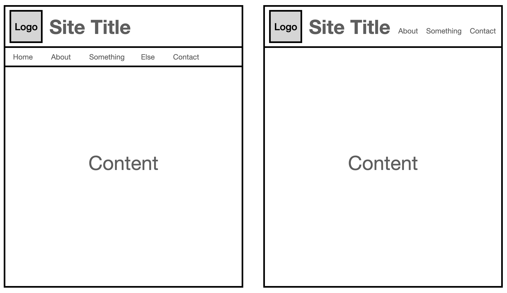
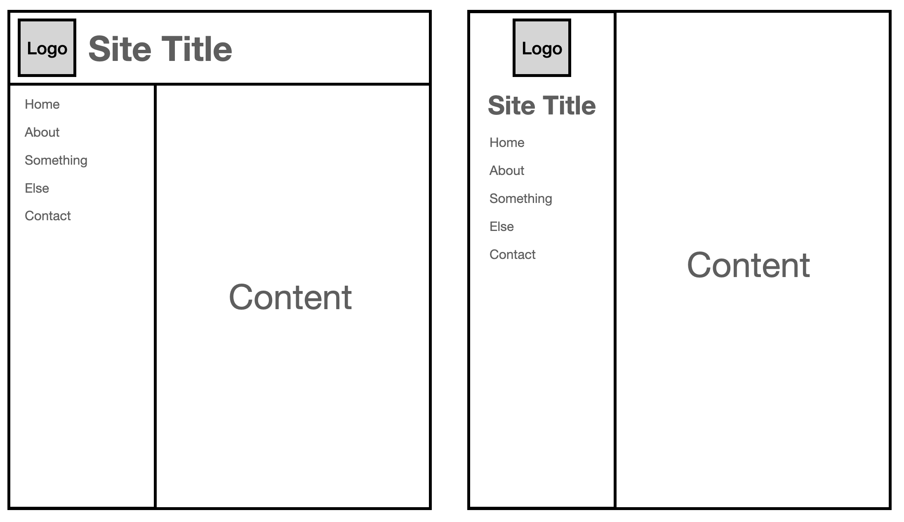
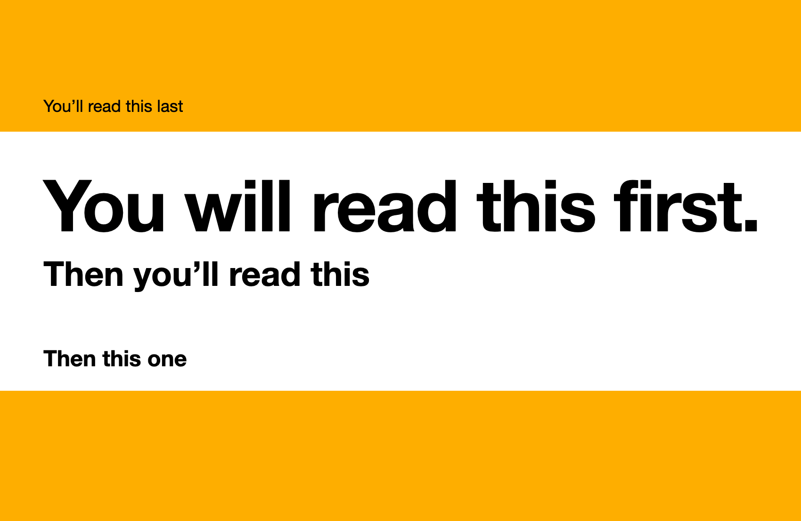
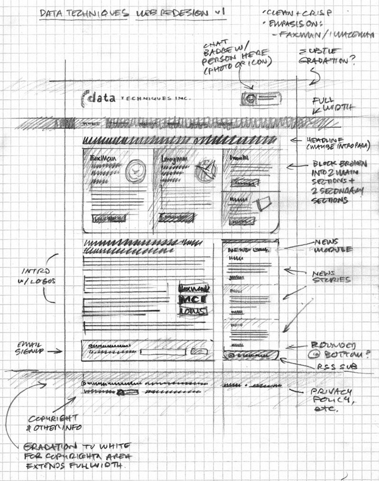
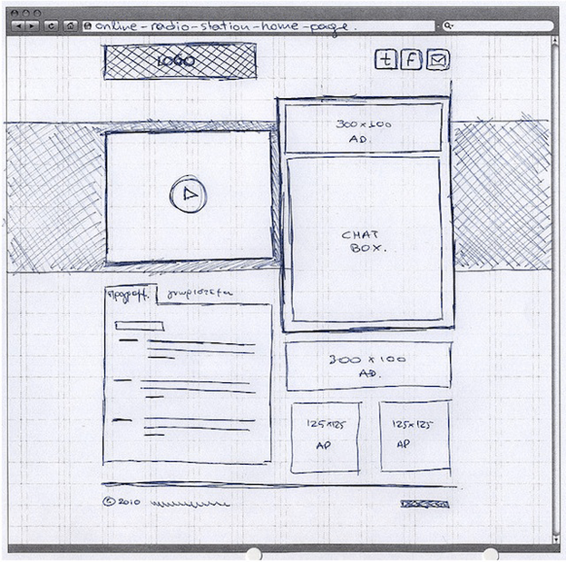

After you have chosen your [colour palettes](colours.md) and [font pairings](fonts.md), you will need to decide how you are going to lay out your page.

There are two aspects to layouts: **placement** and **visual hierarchy**.

# Placement

Take a look back at the websites that you researched. You will notice some consistency amongst them in terms of the placement of items. For example:

- navigation bars (how you get around a website) tend to be at the top of the website, or at the left
- the website logo and title is usually at the top-left, but sometimes at the top-centre
- each section after that usually starts with some kind of heading followed be paragraphs of text

This is no accident — most websites have a similar design to make it easy for users to understand. This is called external consistency, which we touched on previously in [Consistency and Standards](expectations.md#consistency-and-standards).

Your website should have external consistency, too. This means considering where you put:

1. your [header](#header), including logo/site title
3. your [content](#visual-hierarchy)

## Header

The header contains basic information about the website, such as its name, logo, and usually navigation bar. This lets the user know that they are on the correct website and how to move around.

There are two main ways to lay out a header for a desktop-targeted website. These are **on top** and as a **sidebar**:

### On top

With the on top design, the logo, site title, and navigation are contained in a section at the top of the screen.

The following examples show the logo and site title at the top-left. This is merely a convention; you may find some websites that put the logo or title in the middle instead.

Some websites have a separate bar for the navigation, whereas some put the navigation and title on the same line.

### Sidebar

Websites with a sidebar can sometimes have both a header bar (usually with logo, site title, and possibly an image) and a sidebar.

You may also see websites with *only* a side bar; these usually show the logo and title smaller.

# Visual hierarchy

You will notice in the above screenshots that the rest of the website, "Content", is mostly left blank. This section will discuss how to fill it out.

Visual hierarchy means making it clear what the user needs to look at first, then next, then next, then next, etc.

What the user will look at first is determined by:

1. size
2. contrast
3. positioning

## Size

Larger items draw attention. 

In the image above, your eyes are drawn to the "You will read this first." text — it is the largest text and it is bold.

In terms of text, your headings should be in a larger size than the body font. It could also be bold.

The same applies for images — the larger the image, the more attention is drawn to it.

Be careful about having too many elements on screen at the same time in a larger size; it may become difficult for the user to tell what is more important.

## Contrast

There is a lot of contrast in the image above, helping to draw your attention to the important stuff first.

To start with, the black text contrasts well against the white background. This means you will look at the black-on-white text first — and why the "You'll read this last" is read last, despite being further up the page, because the black contrasts poorly with the orange.

## Positioning

Finally, users don't always read text from top to bottom. Even on paper, people have a habit of skimming for the most relevant information.

In this image, the orange borders at the top and bottom focus the attention towards the area in the centre. It focuses the attention to a specific place.

Once you're focused in the right part of the website, you will notice that you start to read downwards. This is both size and positioning at play: as the elements decrease in size downwards, your eyes follow the trail and also move downwards.

# Wireframes

As part of your design, you will create a **wireframe** of your website to show its layout.

A wireframe is a brief sketch showing where elements will be positioned. It helps clients and stakeholders to understand what a site might look like.

> ⛔️ A wireframe is **NOT** a detailed, coloured illustration! It does **NOT** include colours and fonts.

Here are some examples of wireframes:

| Example 1 | Example 2 |
| :-: | :-: |
|  |  |

## What makes a good wireframe?

When drawing a wireframe you need to show structure, but not necessarily the content. This means that you need to show the size and proportionality of things like boxes and images but not the actual text and images that will be used.

<iframe width="560" height="315" src="https://www.youtube.com/embed/8-vTd7GRk-w" title="YouTube video player" frameborder="0" allow="accelerometer; autoplay; clipboard-write; encrypted-media; gyroscope; picture-in-picture" allowfullscreen></iframe>

Makes sure your wireframes:

- are drawn neatly, following a grid on paper
- show not actual dimension but things at appropriate relative sizes
- use boxes with a cross through them for images
- use lines for paragraph text
- use actual lettering for headings
- have annotations (small notes) that describe the functionality and any important things about the site
- how the contrast between different objects on the page

# Task

On the paper provided by the teacher, draw two different wireframes for the home page of your website.

You will see dashed lines — these show normal screen widths. You should aim for your website to fit within the 800 lines, but it's okay for your design to reach the 1024 lines if you are mostly targeting big screens.

Your two wireframes should show different layouts, such as:

- one layout with a header bar, one with a sidebar
- one with a large background image and text on top, one with a smaller image and text below

> Don't just draw the same layout twice! Experiment with different ideas — you will collect feedback on this, so it's important that you give them something to talk about!