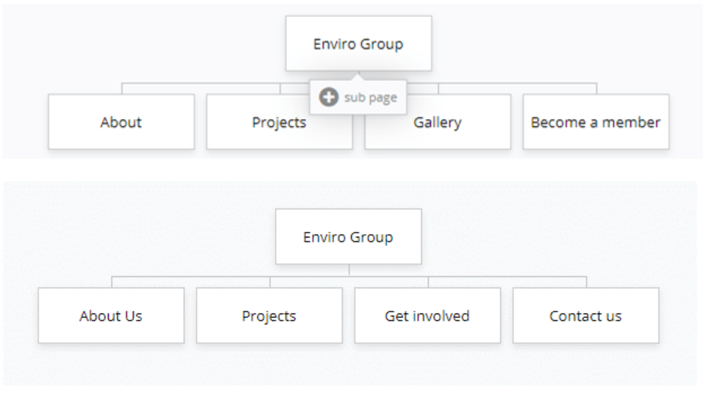

# What is a site map?

A site map is used to show what pages are available on the website and how they connect to each other.

Think about the information you have on your site and what you are trying to communicate:

- which information should you show to end-users on the home page?
- what should you put elsewhere on a linked page?
 
Create a sitemap (or range of sitemaps) below to show how you could structure the pages of your site, them make a comment about why you think the sitemap you have chosen will work well. 

## How do I decide what pages to include?

Check the Teams -> 11DIT -> Files -> General -> Class Materials. This will give you an idea about what sections will be needed on your website.

## Example

## Example feedback

You should collect [feedback and feedforward](feedback.md) about the choice of pages. Ask:

- do I have enough pages to cover all the content?
- do you think the relevant information will be easy to find with the pages in the site map?
- will more pages be needed?
- do the page titles make sense?

# Selecting a site map

Explain why you came up with the choices in your site map(s), and what changes you made along the way based on feedback.

For the above example site map, a student may have written:

> Originally, I had About, Projects, Gallery, and Become a Member as my four subpages.

> However, feedback from Danielle suggested that the gallery was not very relevant to the end users purpose for coming to the site. 

> I also thought the "Become a Member" was too limited, as there are other ways someone could want to get involved.

> I decided to get rid of the gallery, and change "Become a Member" to "Get Involved", and added a "Contact Us" page.