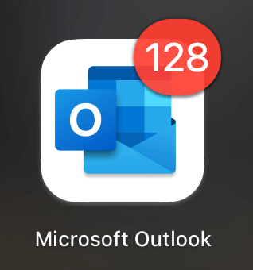
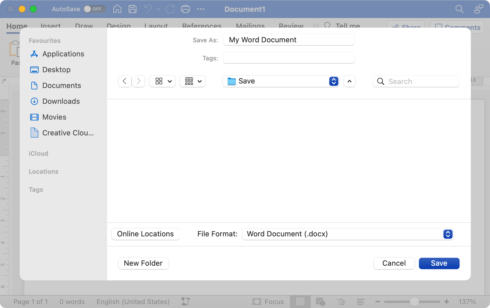
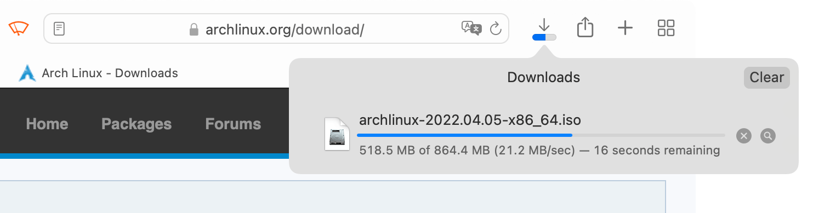
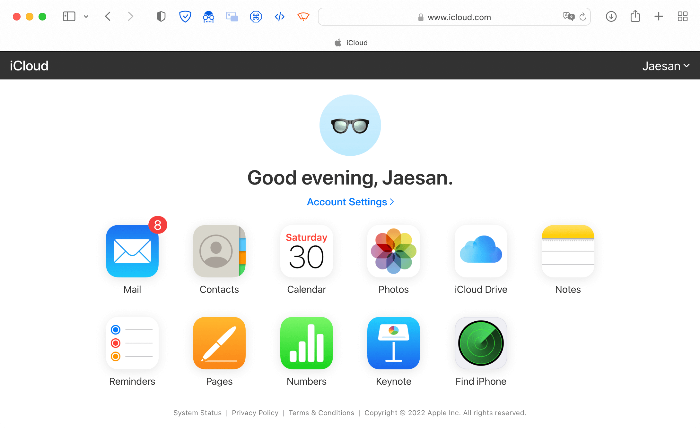
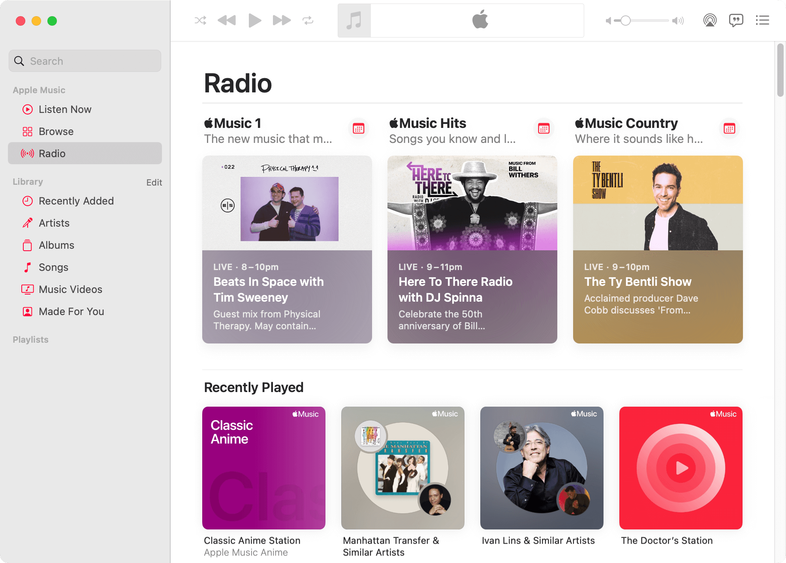
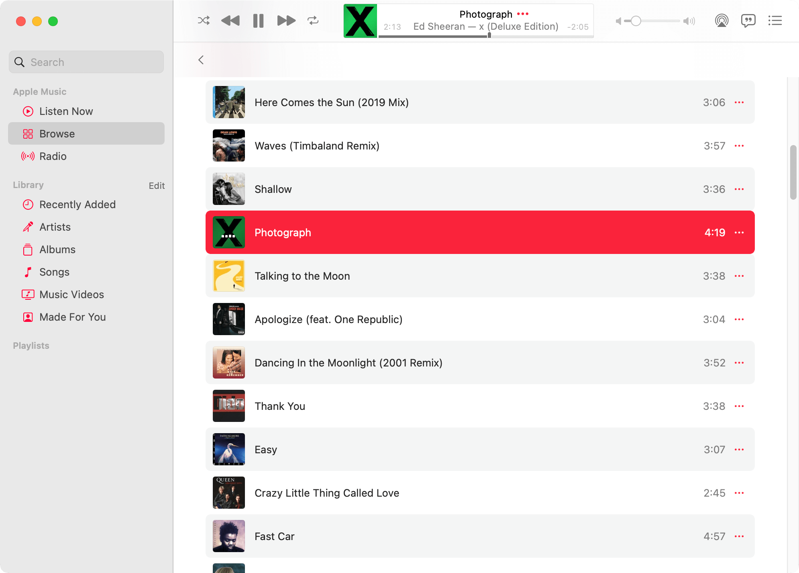
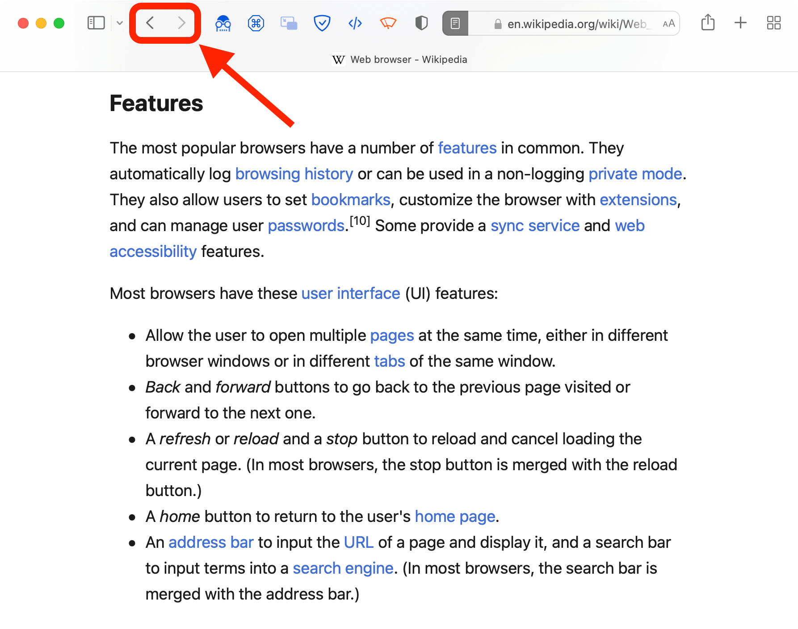
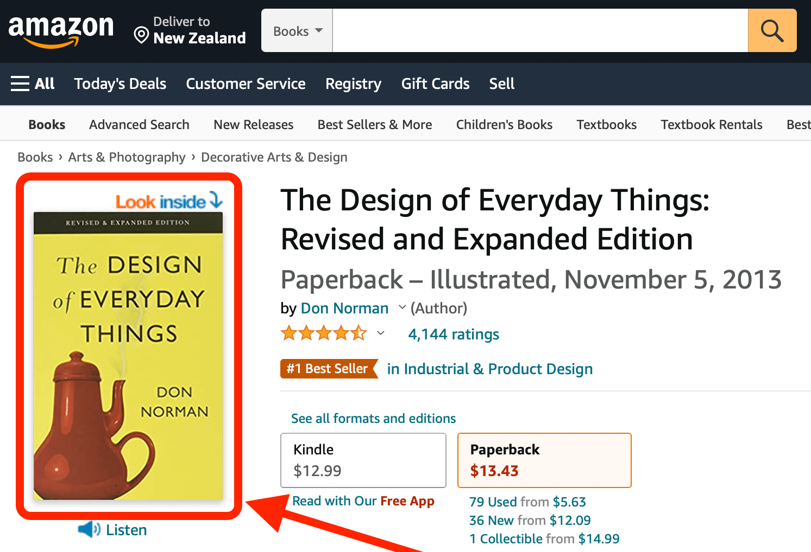

In technology, design refers to both **aesthetics** (how something looks) and **functionality** (how something works). You can't have one without the other.

In 1994, Jakob Nielsen came up with ten general principles for interaction design — how people **use** a technological outcome — called [10 Usability Heuristics for User Interface Design](https://www.nngroup.com/articles/ten-usability-heuristics/).

These are:

1. **Visibilty of system status**
2. Match between system and the real world
3. **User control and freedom**
4. Consistency and standards
5. Error prevention
6. Recognition rather than recall
7. Flexibility and efficiency of use
8. Aesthetic and minimalist design
9. Help users recognise, diagnose, and recover from errors
10. Help and documentation

This page is concerned with heuristics 1 and 3.

# Visibility of system status

> The system should always keep users informed about what is going on, through appropriate feedback within reasonable time.

This heuristic describes the way that a user should always understand where in the program or website they are and/or what is happening. For the feedback to be delivered within a "reasonable time", it should let the user know what's happening when it is most relevant — usually immediately!

There are many ways that something can show its status. For example, a car has a fuel gauge to indicate how much petrol is left in the tank. This shows the status (how much petrol there is), as well as showing it in a reasonable time — imagine if the car only indicated **after** you had run out of petrol!

Likewise, programs and websites should allow the user to see the status of the program, what is going on, and what they are currently looking at.

## Programs

Programs have many ways to indicate the system status. This can come in the form of:

| | | |
| :-- | :-- | :-- |
| {:target="_blank"} | {:target="_blank"} | {:target="_blank"} |
| icons, such as a badge over a Mail program, that indicate notifications | dialog boxes that state that tell the user that something is happening or about to happen | progress indicators that show that something is happening and how long is left |

Note: progress indicators include mouse cursors, such as the famous hourglass, beach ball, or spinning circle. There are also indicators that don't show time remaining, such as the throbber.

## Websites

The above can apply to websites as well, but there are other ways that a website can indicate information to the user:

| | | |
| :-- | :-- | :-- |
| {:target="_blank"} | {:target="_blank"} | {:target="_blank"} |
| a navigation bar that highlights which page is currently being viewed out of a selection | a clear heading that shows what the currently-selected web page is through text | an icon or text showing that a user is logged in (for websites that have accounts), has notifications, etc. |

## Activity 1

Take a look at this program's interface:

{:target="_blank"}

1. What is the purpose of this interface?
2. Is the user browsing their own music or looking for a radio station? How can you tell?
3. Is there a song playing? How can you tell?

Take a look at this next interface:

{:target="_blank"}

4. Is there a song playing?
5. What **three** (3) ways can you tell that the song is playing?

## Activity 2

Take a look at this website's interface:

{:target="_blank"}

1. What is the purpose of this interface?
2. What section of the website is being browsed?
3. How can you tell?

{:target="_blank"}

4. What action has the user just performed to arrive at this page?
5. How can you tell?
6. How many items are going to be purchased?
7. How much will the items cost altogether?
8. 7. What **three** (3) possible ways can you find the answers to 6 and 7?

# User control and freedom

> Users often choose system functions by mistake and will need a clearly marked "emergency exit" to leave the unwanted state without having to go through an extended dialogue. Support undo and redo.

This heuristic is about making sure that when a user makes a mistake in an interface, such as navigating to the wrong part of a website or clicking the wrong button on a program, the user can confidently find the means to undo their error.

Of course, a website has the benefit of the browser's Back button — if the user goes to the wrong page, they can click Back to return to the previous page.

Sometimes the Back button can do other useful things:

- ✅ return to the top of the page, if the user clicked on a table of contents link
- ✅ close a [lightbox](https://en.wikipedia.org/wiki/Lightbox_(JavaScript)) (such as a product image) to return to the version of the same page that does not show the lightbox

However, it can sometimes do some less useful things:

- ⛔️ when a lightbox is showing, it could go back to the previous page rather than simply close the lightbox — this appears to the user as though a single click of the Back button has gone back **two** steps rather than one
- ⛔️ on mobile devices where the browser's Back button and the device's Back button are merged into a single physical or on-screen button, it can sometimes be unclear if the button will return to the previous page or to the previously-opened app
- ⛔️ on some websites, particularly ones that want to keep you on their website rather than let you go back to the previous website, the Back button goes to a page that simply reloads the *current* page

## Activity 3

Navigate to the following websites, then click on the preview image of the product to show the lightbox.

For each website, make a note where the Back button takes you.

- back to the product page?
- back to a different page?

1. [Amazon](https://www.amazon.com/Design-Everyday-Things-Revised-Expanded/dp/0465050654)
2. [MightyApe](https://www.mightyape.co.nz/product/user-interface-design/21267887)
3. [Whitcoulls](https://www.whitcoulls.co.nz/product/windows-11-for-dummies-6694015)
4. [Fishpond](https://www.fishpond.co.nz/Books/macOS-Monterey-For-Dummies-Bob-LeVitus/9781119836964)

## Activity 4

Looking at the websites above, which behaviour makes more sense to you? Explain why.