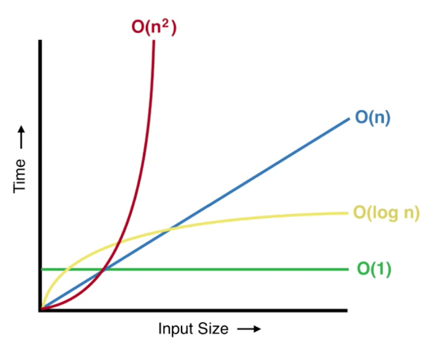

There are many algorithms, or ways to solve certain problems, for any given problem. Some algorithms are more efficient than others.



# Complexity notation

To describe the complexity of an algorithm, computer scientists use **[big-O notation](https://betterprogramming.pub/big-o-notation-for-dummies-like-me-98ac2d141f9f)**. This notation describes the *time complexity*, or how long an algorithm takes to complete. **O** stands for *order of magnitude*.

Generally, one refers to the **worst-case** time complexity of an algorithm to describe it.

| Notation | Time | Meaning | Example |
| :-: | :-: | :-- | :-- |
| O(1) | Constant | This is the best case complexity, meaning that an algorithm completes after operating on a single item in a set or after a single operation | Looking for a number in the phone book, and it's the first one listed on the first page |
| O(***n***) | Linear | ***n*** refers to the size of the data or count of items in a set. This usually represents an algorithm that *could* complete only after operating on each item. This is the *brute force* approach | Looking through every listing on every page in the phone book, starting from A |
| O(***log n***) | Logarithmic | A logarithm is essentially the opposite of an exponent; instead of multiplications, it deals with successive divisions. Thus, if the data set is consistently divided, the number of items is needing processing is reduced. As the item count reduces, the time taken becomes more linear. This is the *divide and conquer* approach | Opening the phone book to the middle, then deciding whether to look in the left or right half of the book, and so on until you find the number |
| O(***n2***), O(***n3***), O(***n4***), etc. | Quadratic | This complexity can be very quick for small data sets but becomes much slower for large data sets. This is especially true for data that contains other data (nested sets, 2D lists, etc.) because not only must the algorithm work on every item but also each subitem | Looking through every listing on every page in the phone book, starting from A, **and** checking each digit of the phone number |
| O(***n log n***) | 

# Searching algorithms

One of the more basic examples is searching algorithms. These deal with finding an item or items from a set. The specific types of searching algorithms we'll look at are **linear** and **binary**.

## Linear search

If items in a set are out of order, there's really only one way to find a specific item — check each and every one.

Imagine a line of boxes numbered one to ten. Under one of the boxes is a dollar coin. To find the dollar coin, you need to check under each box along the line.

Now, imagine the boxes are put in numerical order and the coin is moved to a different box. Would a linear search improve the process? No, because you would still be checking every box.

You could get lucky and find the coin under the first box — or unlucky, and it's under the tenth.



[Try it for yourself!](https://www.csfieldguide.org.nz/en/interactives/searching-algorithms/?start-level=0&end-level=1)

## Binary search

On the other hand, a binary search is much more efficient for certain kinds of searches.

Imagine the boxes are in random order but facing away from you. You're not looking for a coin anymore but rather a specific box — number 7.

Instead of blinding checking each box, you could:

1. start with the middle box
2. turn it around, and check what number is written on it
3. It's 5, so we know to check the box to the right
4. It's 6, we're on the right track. Next box!
5. It's 7, we found it

[Try it for yourself!](https://www.csfieldguide.org.nz/en/interactives/searching-algorithms/?start-level=2)



<iframe width="560" height="315" src="https://www.youtube.com/embed/KXJSjte_OAI" title="YouTube video player" frameborder="0" allow="accelerometer; autoplay; clipboard-write; encrypted-media; gyroscope; picture-in-picture" allowfullscreen></iframe>

# Sorting algorithms

Further, let's examine algorithms that *sort* items in a set. For example, an algorithm could sort numbers from lowest to highest, words into alphabetical order, or by some other custom condition.

<iframe width="560" height="315" src="https://www.youtube.com/embed/rL8X2mlNHPM" title="YouTube video player" frameborder="0" allow="accelerometer; autoplay; clipboard-write; encrypted-media; gyroscope; picture-in-picture" allowfullscreen></iframe>

## Selection sort

One of the most intuitive ways to sort a group of boxes into order, from lightest to heaviest, is to start by first finding the lightest (or the heaviest) box and placing that to the side. Try this with the [scales interactive](https://www.csfieldguide.org.nz/en/interactives/sorting-algorithms/).

After finding the lightest box simply repeat the process again with the remaining boxes until you find the second lightest, now place that to the side alongside the lightest box. If you keep repeating this process you will eventually find you have placed each box into order. Try sorting the whole group of boxes in the scales interactive into order using this method and count how many comparisons you have to make.

Tip: Start by moving all the boxes to the right of the screen and then once you have found the lightest box place it to the far right (if you want to find the heaviest first instead then move them all to the left).

If you record how many comparisons you had to make each time to find the next lightest box you might notice a pattern (hint: finding the lightest should take 7 comparisons, and then finding the second lightest should take 6 comparisons…). If you can see the pattern then how many comparisons do you think it would take to then sort 9 boxes into order? What about 20? If you knew how many comparisons it would take to sort 1000 boxes, then how many more comparisons would it take to sort 1001 instead?

This algorithm is called selection sort, because each time you look through the list you are 'selecting' the next lightest box and putting it into the correct position. If you go back to the algorithms racing interactive at the top of the page you might now be able to watch the selection sort list and understand what it is doing at each step.

The selection sort algorithm can be described as follows:

Find the smallest item in the list and place it to one side. This will be your sorted list.
Next find the smallest item in the remaining list, remove it and place it into your sorted list beside the item you previously put to the side.
Repeat this process until all items have been selected and moved into their correct position in the sorted list.
You can swap the word 'smallest' for 'largest' and the algorithm will still work, as long as you are consistent it doesn't matter if you are looking for the smallest or the largest item each time.

## Insertion sort

This algorithm works by removing each box from the original group of boxes and inserting it into its correct position in a new sorted list. Like selection sort, it is very intuitive and people often perform it when they are sorting objects themselves, like cards in their hands.

Try this with the scales interactive. Start by moving all the boxes to one side of the screen, this is your original, and unsorted, group. Now choose a box at random and place that on the other side of the screen, this is the start of your sorted group.

To insert another box into the sorted group, compare it to the box that is already in the sorted group and then arrange these two boxes in the correct order. Then to add the next box compare it to these boxes (depending on the weight of the box you might only have to compare it to one!) and then arrange these three boxes in the correct order. Continue inserting boxes until the sorted list is complete. Don't forget to count how many comparisons you had to make!

Insertion sort can be described with informal instructions as follows:

Take an item from your unsorted list and place it to the side, this will be your sorted list.
One by one, take each item from the unsorted list and insert it into the correct position in the sorted list.
Do this until all items have been sorted.
People often perform this when they physically sort items. It can also be a very useful algorithm to use if you already have a sorted set of data and want to add a new piece of data into the set. For example if you owned a library and purchased a new book you wouldn't do a selection sort on the entire library just to place this new book, you would simply insert the new book in its correct place.

## Quicksort

Insertion and selection sort may seem like logical ways to sort things into order, but they both take far too many comparisons when they are used for large amounts of data. Remember computers often have to search through HUGE amounts of data, so even if they use a good searching algorithm like binary search to look through their data, if they use a bad sorting algorithm to first sort that data into order then finding anything will take far too long!

A much better sorting algorithm is quicksort! (the name is a bit of a giveaway)

[Try it out using the interactive](https://www.csfieldguide.org.nz/en/interactives/sorting-algorithms/?method=quick).

This algorithm is a little more complicated, but very powerful. To do this algorithm with the sorting interactive, start by randomly choosing a box and placing it on the scales. Now compare every other box to the one you selected; heavier boxes should be put on the right of the second row and lighter boxes are put on the left. When you are done, place the box you were comparing everything else to between these two groups, but to help you keep track of things, put it in the row below. The following example shows how it might look after this step. Note that the selected block is in the right place for the final sorted order, and everything on either side will remain on the side that it is on.

Now apply this process to each of the two groups of boxes (the lighter ones, then the heavier ones). Keep on doing this until they are all sorted. The boxes should then be in sorted order!

It might be worth trying this algorithm out a few times and counting the number of comparisons you perform each time. This is because sometimes you might be unlucky and happen to pick the heaviest, or the lightest box first. On the other hand you might be very lucky and choose the middle box to compare everything to first. Depending on this the number of comparisons you perform will change.

Quicksort can be described in the following way:

1. choose an item from the list and compare every other item in the list to this (this item is often called the pivot)
2. place all the items that are greater than it into one subgroup and all the items that are smaller into another subgroup. Place the pivot item in between these two subgroups
3. choose a subgroup and repeat this process. Eventually each subgroup will contain only one item and at this stage the items will be in sorted order.

# Task 1

Explain the complexity of each sorting algorithm:

- selection sort
- insertion sort
- quicksort

1. give a **real world** example of each sort algorithm
    - what data could be being sorted?
    - how would you sort the data, following the principles of the algorithm?
    - for example: 

# Task 2

Try this Intro to Algorithms Kahoot] a couple of times. Go for a high score!

- [Kahoot for RJA students](https://kahoot.it/challenge/09804552?challenge-id=a8e79509-f894-4bef-a645-5ef73dc88e06_1663020983819)
- [Kahoot for VTA students](https://kahoot.it/challenge/01803688?challenge-id=a8e79509-f894-4bef-a645-5ef73dc88e06_1663021096379)