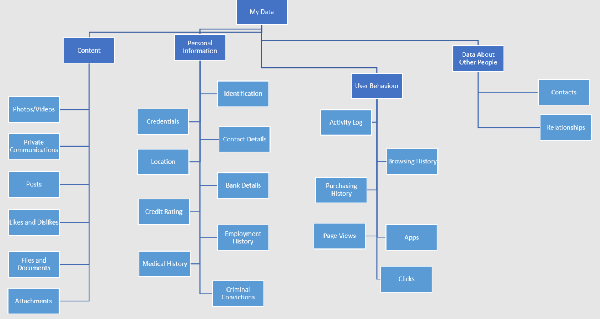
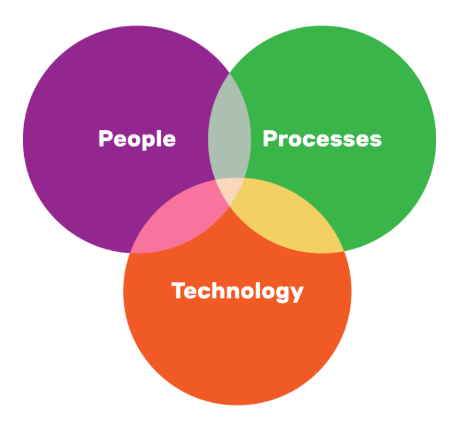

# What is data?

The term **data**, in a security context, refers to the information that we create and use when interacting with online services like apps and websites, or the information that we store on electronic devices. We might generate this data intentionally, or we might not know that it exists. All of this data has the potential to be valuable and needs to be protected.

Examples of data include personal information, content, information about user behaviour, and data about other people.









How much data do you think you have generated today?

It is estimated that we collectively generate 2.5 quintillion bytes of data each day, which is the equivalent of nearly **7 billion days** worth of YouTube videos.

# The data economy

Much of our data is valuable to us, but it is also valuable to other people and to companies. For example, user behaviour and content is valuable to companies because it helps them to optimise their service for you, it increases their ability to sell to you, and it makes their product more efficient.

For example, a clothing company may be interested in acquiring your browsing history as it might tell them what sorts of products you are trying to purchase, enabling them to tailor an advert to your interests. A telemarketer might wish to buy your phone number so that they can contact you about their products.

This data has its own market value and is sold between companies. There are specific companies called data brokers that collect and sell customer data.

<iframe width="560" height="315" src="https://www.youtube.com/embed/IvDcdCsb344" title="YouTube video player" frameborder="0" allow="accelerometer; autoplay; clipboard-write; encrypted-media; gyroscope; picture-in-picture" allowfullscreen></iframe>

In addition to the data economy, there is an underground trade of stolen data. Data such as login details for website accounts, bank account details, and contact details is sold in batches and could be used by attackers to hack your accounts, steal your money, or impersonate you.

Even data that may seem harmless, such as the name of your first pet or your favourite number, has market value, because it can be used to guess your passwords. Watch this video about how data brokers use personal data:

<iframe width="560" height="315" src="https://www.youtube.com/embed/AU66C6HePfg" title="YouTube video player" frameborder="0" allow="accelerometer; autoplay; clipboard-write; encrypted-media; gyroscope; picture-in-picture" allowfullscreen></iframe>

Organisations have a responsibility to protect your data from malicious attackers. They use cybersecurity processes to do this. You can also use cybersecurity practices to protect your own data.

# Cybersecurity

Cybersecurity is the practice of protecting data from threats such as theft and corruption. These threats include attacks as well as accidental breaches.

Cybersecurity is often context-specific, so different individuals and different sorts of organisations will have different requirements. They will also have different resources available to implement their cybersecurity policy.

However, all cybersecurity approaches should utilise the three pillars of cybersecurity. These are **people**, **processes** and **technology**. This is because good cybersecurity practice requires a knowledgeable and motivated person who is able to enact good practice, a clear process that defines what is expected of them, and the right technology so that they can follow this process.

# Task

You may work in groups to research these answers, but you should submit your own responses. Find out:

1. Give your **opinion**: which of the three pillars would have the biggest impact on privacy, and why?
2. Read [A Day in the Life of Your Data](https://www.apple.com/nz/privacy/docs/A_Day_in_the_Life_of_Your_Data.pdf). In particular, read pages 4 and 5. Come up with **three** (3) apps or online services you use, like John and Emma, that could be capturing your data and selling it.
    - What kind of data is being captured? Personal information, content, user behaviour, or information about other users?
3. Apple introduced [Privacy Nutrition Labels](https://www.apple.com/nz/privacy/labels/) for their own applications and you can also see the PNLs for apps on the App Store. Google also has increased [privacy information](https://blog.google/products/google-play/data-safety/) for Google Play Store apps on Android. Explain how the privacy nutrition labels relate to each of the three pillars of cybersecurity.
4. Apart from privacy nutrition labels, what protections could you enable to have better control over your data in apps and online services? Come up with **three** (3) examples.