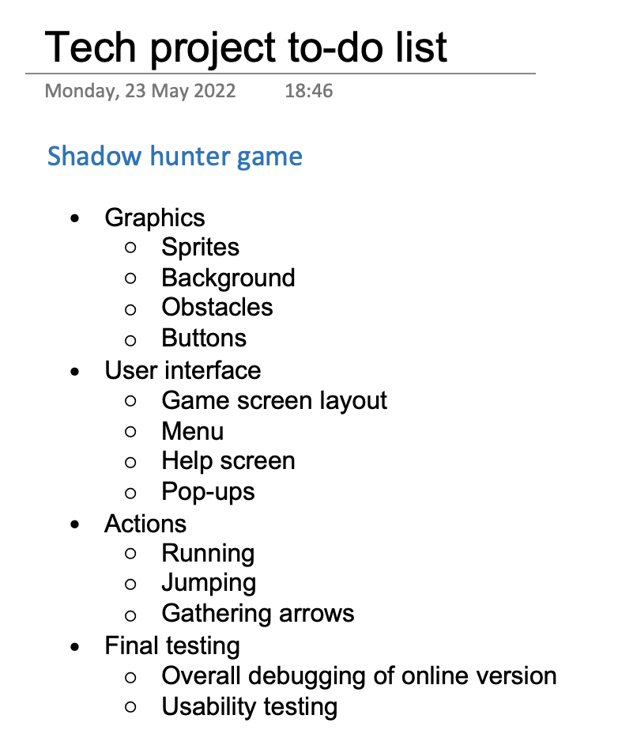
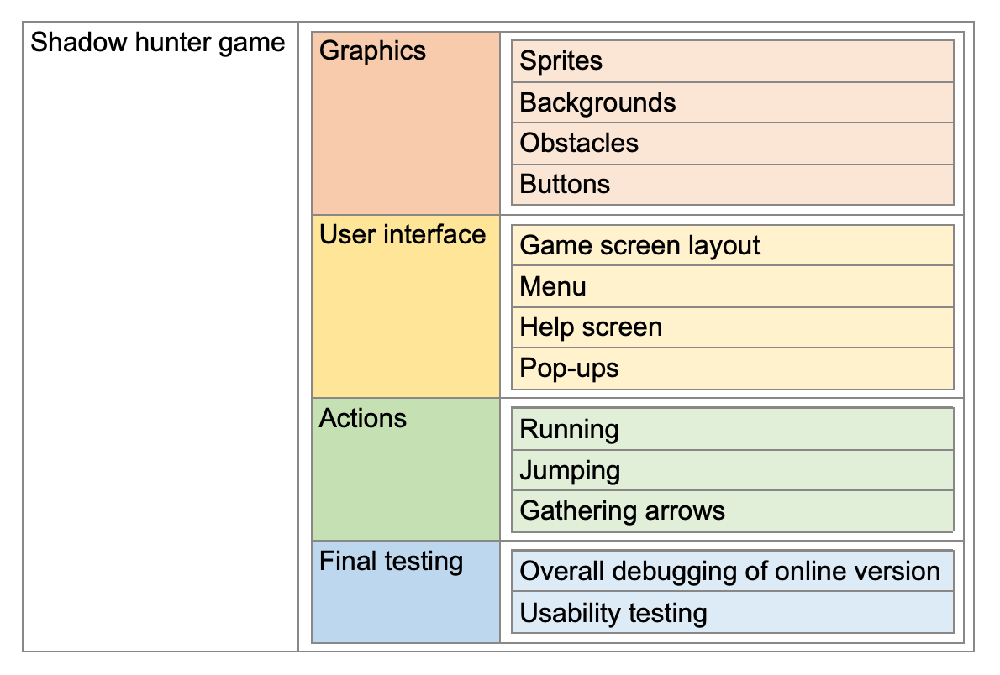
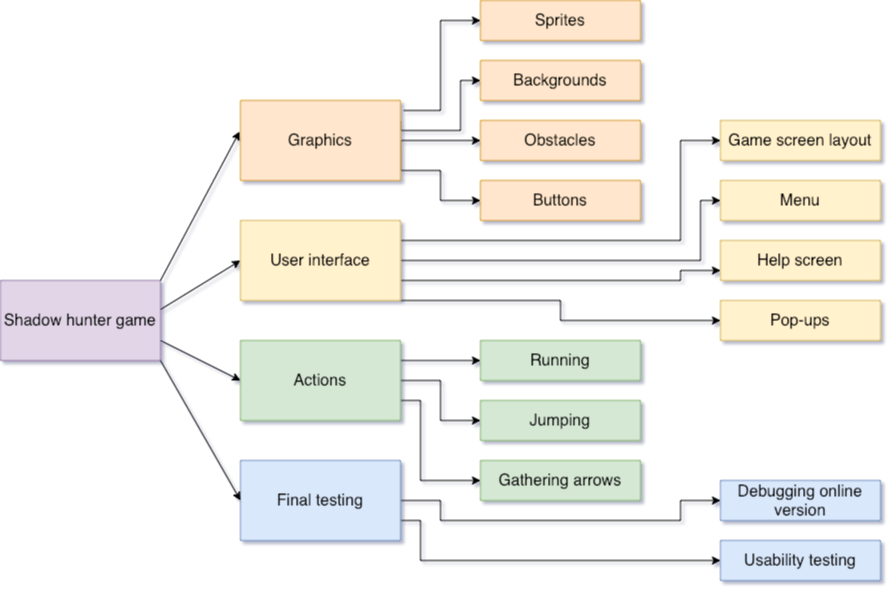

# Iterative development

In your project, iterative development means you will repeat some parts of the process - you will work on components of the project one after the other, each time use testing and trialling to improve that part of the outcome. Your outcome will take shape and change as you develop each of the components.

[Agile project management](https://www.dummies.com/article/business-careers-money/business/project-management/agile-project-management-for-dummies-cheat-sheet-208332/) is an example of iterative development methodology.

# Decomposition

In biology, decomposition means breaking down organic material into smaller parts.

Just like in biology, you will be breaking your outcome development down into smaller tasks, making it easier to keep track of your progress and improve your outcome iteratively as you develop it. 
 
As you begin your project planning you should break your overall task down into smaller components.
 
- **outcome** = the item that you are making
- **component** = a small part of the outcome
- **developing** = making your outcome
 
Each component should be a logical chunk of the project — a piece that you need to make or a feature that you want to add. These are also sometimes referred to as **deliverables**. It helps if each component is something that can be tested before adding it to the outcome. 
 
Some examples of components are:

- the CSS for a website
- functions for a program
- queries for a database
- subsystems in an electronics circuit
- systems or parts in a network development

## Tools you could use to decompose your project

### To-do list

The simplest way you could plan out the steps in your project is by making a list of tasks.

You could do this on paper, an online document or in an app such as OneNote. To do lists on paper are easy and quick to make, but if a list is digital it’s easy to update and re-order items. Use a tool that is easy to update and share, as your plans will usually change as you progress through your project!

Ensure your list shows which individual task is part of which project component. 

- most list-making apps sync across devices and allow you to share with collaborators 
- to-do lists on paper are hard to share with teachers and collaborators 
- handwriting can be messy  
- when you update a handwritten list it gets confusing 
- if you are working in a team you need to make sure all members have access to the list  
- as you work, you might want to cross off items but not delete them from the list, so you can see what has already been done

### Decomposition table

Tables are an orderly way to show your tasks and can be made in most common document formats. You could use an online document to share with others in your team, and paste a copy directly into your evidence document for this standard. 

- tables are tidy 
- easy to share if in an online document 
- less visually appealing than a mind-map 
- you need to know how to merge cells and insert or delete rows to update your tasks as you go

### Mind map

Diagrams are an easy way of showing categories and connections. You can make mind-maps using pen and paper, a whiteboard, most common document types or by using an online tool. Make sure you choose something that can be updated if necessary and easily shared with your team and teacher.

Mind mapping apps include [Lucidchart](https://www.lucidchart.com/pages/), [Draw.io/Diagrams.net](https://diagrams.net/), [Padlet](https://padlet.com) or [Bubbl.us](https://bubbl.us). Alternatively, you can draw one in OneNote or similar.

- fun and easy to make 
- show the task categories at a glance 
- a digital version is easy to edit and update 
- colour can be used to categorise items 
- easy to accidentally erase if it’s on a whiteboard in a shared area 
- handwriting can be messy and hard to read
- if you are working in a team you need to make sure all members have access

# Tasks

## Task 1

You are helping your Ako teacher plan a shared meal for your class.

All your teacher has given you is the menu — they will do the preparation in the staff room before school — so all you need to do is **decompose** the meals into individual ingredients.

Create a to-do list with all the ingredients you will need for each meal so that you know what to purchase.

- [Chicken sushi](https://www.tegel.co.nz/recipes/teriyaki-chicken-sushi/)
- [Vegan sushi](https://foodwithfeeling.com/easy-vegan-sushi/)
- [Pancakes](https://www.chelsea.co.nz/browse-recipes/old-fashioned-pancakes/)

> **Remember**: you don't need to use a computer for this. You can do this on pen-and-paper if you like.

## Task 2

Create a decomposition table version of your to-do list from task 1 — but make the following iterative changes:

- students were surveyed and everybody in the class agree they would prefer Japanese mayonnaise instead of wasabi paste
- self-raising flour is too expensive. The teacher would prefer to use regular flour and baking powder

## Task 3

Create a mind map version of your decomposition table from task 2 — but make the following iterative changes:

- students were surveyed and everybody in the class agree they don't like avocado
- some students can't have dairy so some pancakes will need to be made with a milk alternative

## Task 4

Evaluate each method of decomposition by creating PMI tables for each type:

### To-do list

| Plus | Minus | Interesting |
| :-: | :-: | :-: |
|  |  |  |

### Decomposition table

| Plus | Minus | Interesting |
| :-: | :-: | :-: |
|  |  |  |

### Mind map

| Plus | Minus | Interesting |
| :-: | :-: | :-: |
|  |  |  |