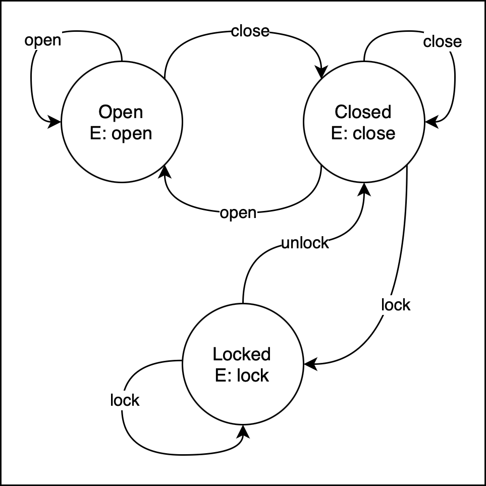

# What are Finite-State Machines?

A **finite-state machine** (FSM; also called finite-state automaton or FSA) is an *abstract machine* (as in, not a real machine but the idea of one). This machine can exist in one of a finite (known in advance) number of **states** at a time.

A state can describe a value in a variable, multiple variables, or the output that one could expect to receive from a machine. States can change depending on what inputs are provided.

Finite state machines are theoretical but are useful for describing anything **stateful** (something that has states), even real world machines such as light bulbs.

## Example 1: Light bulb


For example, let's think of an FSA for a light bulb. A light bulb has two states:

| State 1 | State 2 |
| :-: | :-: |
| ❌ Off | ✅ On |



The input for a light bulb is electricity. The presence or absence of electricity to the light bulb is determined by a switch on the wall.

However, the input is not alone. An action must occur for the input to affect the machine. In this case, it's when you flick the light switch on and off.

1. If the light bulb is receiving **no** electricity, flick the switch **down** — this will provide electricity and the light bulb will change state from **off** to **on**
2. If the light bulb is receiving **any** electricity, flick the switch **up** — this will prevent electricity from reaching the light bulb, and the light bulb will change state from **on** to **off**.

This can be represented using a state transition table.

| Current State | Input | Next State | Output |
| :-: | :-- | :-: | :-- |
| ❌ Off | Flick switch down | ✅ On | Light turns on |
| ✅ On | Flick switch up | ❌ Off | Light turns off |

# Example 2: Door


Consider a front door. It has a handle and a lock, accessible via a key hole. At its basic level, it also has two states:

| State | State |
| :-: | :-: |
| ❌ Closed | ✅ Open |



However, it also has the following additional state:

| State |
| :-: | :-: |
| 🔐 Locked |

There is no need for an unlocked state — we can assume that if the door is closed, it is unlocked.

> Why can we assume that? Because an FSM can only be in one state at a time; therefore, if the state is not Locked, we infer that the door is unlocked.

The door has the following inputs:

- Put key in and **lock**
- Put key in and **unlock**
- Use the door handle to **open**
- Pull the door handle to **close**

Let's add the following restrictions:
- you can only modify the lock's state if the door is closed

Here is the state transition table for the door:

| Current State | Input | Next State | Output |
| :-: | :-- | :-: | :-- |
| Locked | Lock | Locked | 🚫 The door is already locked; no change |
| Locked | Unlock | Closed | Unlocks the door, but the door remains closed |
| Closed | Lock | Locked | Locks the door so it *can't* be opened |
| Closed | Unlock | Closed | 🚫 The door is already unlocked; no change |
| Closed | Open | Open | Opens the door |
| Closed | Close | Closed | 🚫 The door is already closed; no change |
| Open | Lock | Open | 🚫 Locking an open door is disallowed |
| Open | Unlock | Open | 🚫 Unlocking an open door is disallowed |
| Open | Open | Open | The door is already open; no change |
| Open | Closed | Closed | Closes the door; it can now be locked |

## Diagram

This is a very complex table, quite hard to read. Instead of representing the state transitions with a table, it might be easier to use a diagram.

[](img/States.png)

In the above diagram:

- circles represent the state
  - the E represents the **entry action**: how to enter this state
- each line represent **transition**, the movement between one state and another
  - the arrow at the end of the line represents the target state
  - the text on the transitions represents the **condition**: what must happen for the transition to occur
  - **note**: notice how redundant transitions (opening an open door) lead back to the same state. These are optional; you can leave these out of your state diagrams.

# Next steps

Finite-state machines help us define the rules for a formal language. Let's go back to the code snippet from the previous page.


Right:
```python
x = (a+b) * (c+d)
```


Wrong:
```python
x = (a+b) * c+d)
```



At a very basic level, we could describe the difference between these two pieces of code as being in a **Valid** state and an **Invalid** state. How we enter these states depends on the text that is typed.

