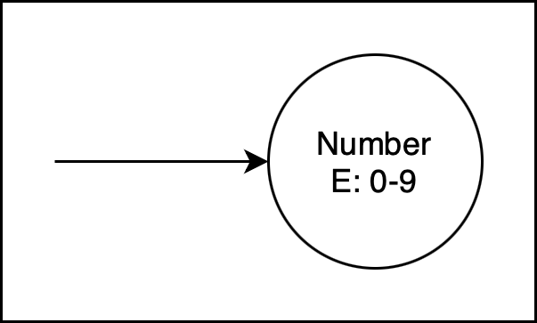
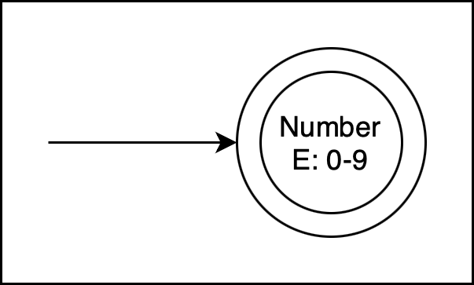
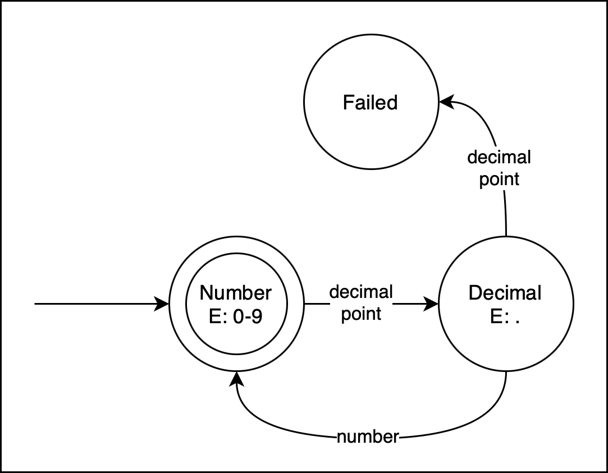

# What are Finite-State Machines?

A **finite-state machine** (FSM; also called finite-state automaton or FSA) is an *abstract machine* (as in, not a real machine but the idea of one). This machine can exist in one of a finite (known in advance) number of **states** at a time.

A state can describe a value in a variable, multiple variables, or the output that one could expect to receive from a machine. States can change depending on what inputs are provided.

Finite state machines are theoretical but are useful for describing anything **stateful** (something that has states), even real world machines such as light bulbs.

## Example 1: Light bulb


For example, let's think of an FSA for a light bulb. A light bulb has two states:

| State 1 | State 2 |
| :-: | :-: |
| ❌ Off | ✅ On |



The input for a light bulb is electricity. The presence or absence of electricity to the light bulb is determined by a switch on the wall.

However, the input is not alone. An action must occur for the input to affect the machine. In this case, it's when you flick the light switch on and off.

1. If the light bulb is receiving **no** electricity, flick the switch **down** — this will provide electricity and the light bulb will change state from **off** to **on**
2. If the light bulb is receiving **any** electricity, flick the switch **up** — this will prevent electricity from reaching the light bulb, and the light bulb will change state from **on** to **off**.

This can be represented using a state transition table.

| Current State | Input | Next State | Output |
| :-: | :-- | :-: | :-- |
| ❌ Off | Flick switch down | ✅ On | Light turns on |
| ✅ On | Flick switch up | ❌ Off | Light turns off |

## Example 2: Door


Consider a front door. It has a handle and a lock, accessible via a key hole. At its basic level, it also has two states:

| State | State |
| :-: | :-: |
| ❌ Closed | ✅ Open |



However, it also has the following additional state:

| State |
| :-: | :-: |
| 🔐 Locked |

There is no need for an unlocked state — we can assume that if the door is closed, it is unlocked.

> Why can we assume that? Because an FSM can only be in one state at a time; therefore, if the state is not Locked, we infer that the door is unlocked.

The door has the following inputs:

- Put key in and **lock**
- Put key in and **unlock**
- Use the door handle to **open**
- Pull the door handle to **close**

Let's add the following restrictions:
- you can only modify the lock's state if the door is closed

Here is the state transition table for the door:

| Current State | Input | Next State | Output |
| :-: | :-- | :-: | :-- |
| Locked | Lock | Locked | 🚫 The door is already locked; no change |
| Locked | Unlock | Closed | Unlocks the door, but the door remains closed |
| Closed | Lock | Locked | Locks the door so it *can't* be opened |
| Closed | Unlock | Closed | 🚫 The door is already unlocked; no change |
| Closed | Open | Open | Opens the door |
| Closed | Close | Closed | 🚫 The door is already closed; no change |
| Open | Lock | Open | 🚫 Locking an open door is disallowed |
| Open | Unlock | Open | 🚫 Unlocking an open door is disallowed |
| Open | Open | Open | The door is already open; no change |
| Open | Closed | Closed | Closes the door; it can now be locked |

### Diagram

This is a very complex table, quite hard to read. Instead of representing the state transitions with a table, it might be easier to use a diagram.

[](img/States.png)

In the above diagram:

- circles represent the state
  - the E represents the **entry action**: how to enter this state
- each line represent **transition**, the movement between one state and another
  - the arrow at the end of the line represents the target state
  - the text on the transitions represents the **condition**: what must happen for the transition to occur
  - **note**: notice how redundant transitions (opening an open door) lead back to the same state. These are optional; you can leave these out of your state diagrams.

# Task 1

Create a state transition table and state transition diagram for a machine that represents a traffic light circuit. The rules are:

- the light can be Green, Amber, or Red
- when the light is:
  - green, it turns amber after 45 seconds
  - amber, it turns red after 10 seconds
  - red, it turns green after 55 seconds
- the transition event is a timer ticking each second
  - be sure to label the transition *condition*
  - don't forget to represent what happens if the appropriate number of seconds has not yet passed — does the state change or remain the same?

# State types

On a state transition diagram, you can specify the state of a machine using the circles. However, there are different types of states depending on if the machine has just started processing or should finish processing input. It's best to explain with an example:

## Example 3: Parsing a decimal number

Let's say you want to [parse](fl_grammar#parsing) a string to determine if it is a valid number.

The rules are:

- it is a number only if it contains 0, 1, 2, 3, 4, 5, 6, 7, 8, 9, or a decimal point
- there can only be one decimal point or none at all
- the decimal point must have numbers on either side
- there can be any number of digits before and after the decimal point

Here are some examples of valid inputs:

| Valid | Reason for validity |
| :-: | :-- |
| 1 | Contains a digit, no decimal point required |
| 1.0 | Starts with digit, then decimal point, then another digit |
| 45.6 | Contains any number of digits before decimal point |
| 3.14 | Contains any number of digits after decimal point |

And here are some invalid inputs:

| Invalid | Reason for invalidity |
| :-: | :-- |
| .0 | Starts with a decimal point; must start with a number |
| 0.. | Two decimal points; must only contain one |
| abc | Contains invalid characters |
| 3.ad | Contains invalid characters |
| | No characters |

### Start state

What the above state examples don't include is the **start state**. This is the first state that we can expect the process to enter. Normally, the start state is whatever state the program would be in with the first item of input.

For this machine, the start state would be checking for a digit — after all, a valid number starts with a digit.


[](img/States-start.png)



### Accepting state

An **accepting state** is a state where the machine produces a correct output. It's called the *accepting* state because if the last input puts the machine in this state, the input is accepted — it follows the rules. If the last input puts the machine in any other state, the input is rejected — it does *not* follow the rules.

A basic finite state machine can only have one accepting state. This rule is sufficient for our purposes.

For this machine, we can also treat the start state as the accepting state — after all, a valid number ends with a digit.




[](img/States-accept.png)



### Failure state

To specify an explicit **failure state**, where the machine should no longer continue, you can create a state with no outgoing transitions. This means it is not possible to leave the failure state — the machine is finished, the rules are not met, the program is over.




[](img/States-failure.png)



# Task 2

Create a state transition diagram for the following machine that looks for a valid number. It's similar to [example 3](#example-3-parsing-a-decimal-number), but it has the following rules:

- it is a number only if it contains 0, 1, 2, 3, 4, 5, 6, 7, 8, 9, or a decimal point
- there can only be one decimal point or none at all
- the decimal point must have numbers on either side
- there can be any number of digits before and after the decimal point
- **NEW**: the first digit cannot be zero *except* if the next character is a decimal point

Further, instead of the transitions representing "digit" and "decimal point", you should add transitions for each of the inputs: "0", "1", "2", … etc.

# Next steps

Finite-state machines help us define the rules for a formal language. Let's go back to the code snippet from the previous page.


Right:
```python
x = (a+b) * (c+d)
```


Wrong:
```python
x = (a+b) * c+d)
```



At a very basic level, we could describe the difference between these two pieces of code as being in a **Valid** state and an **Invalid** state. How we enter these states depends on the text that is typed.

