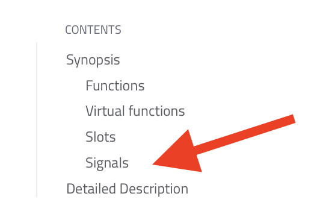
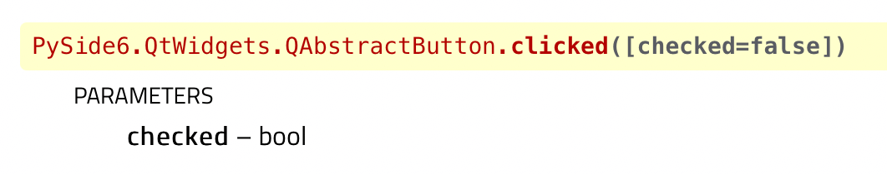
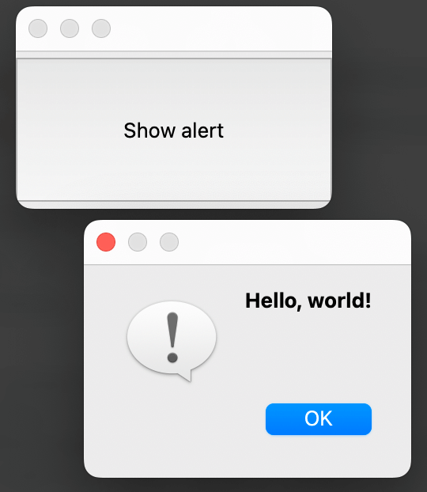
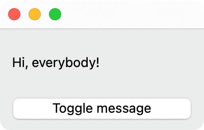
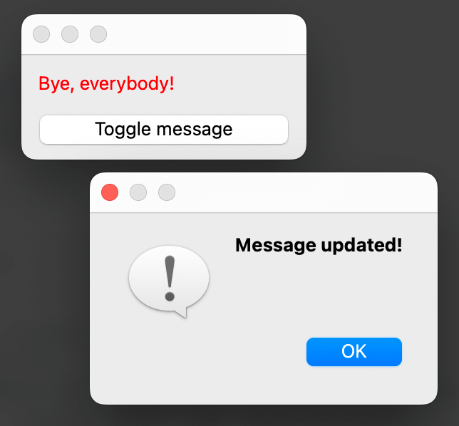

# Signals

In order for widgets to *do* anything, such as for some code to run when a button is clicked, you need to set up the widgets to respond to **events**. In Qt, this is achieved with functions that connect to widgets' **signals**.


Widgets emit signals when the user interfacts with them. For example, a ``QPushButton`` emits a ``clicked`` signal when the user clicks on it.

## Discovering a widget's signals

You can find out what signals a widget supports by reading the documentation for it. For example, the page for [``QAbstractButton``](https://doc.qt.io/qtforpython/PySide6/QtWidgets/QAbstractButton.html) (which is ``QPushButton``'s superclass) lists the signals that its subclasses support.

> You can also see all of the signals available to a widget by clicking on the Signals link on the **top-right corner** of the page<br>

There are various signals that each widget supports. These are used to respond to certain events, such as:

- clicking on a widget
- pressing the mouse button down over a widget
- releasing the mouse button
- editing text in a textbox (i.e. ``QLineEdit``)

Once you have found a signal that corresponds to your needs, you create a signal function and connect it to the widget — when the signal is emitted, the function receives it and is run.

## Creating a signal function

To make the widgets respond to the signals, you must:

1. create a function with certain parameters
2. connect that function to the widget's signal

Looking at the documentation for ``QAbstractButton``, you will see the following list of signals:

- ``def clicked ([checked=false])``
- ``def pressed ()``
- ``def released ()``
- ``def toggled (checked)``

Checking out the ``clicked`` signal's documentation, you will see a function signature and list of parameters:



From this, you can see that the function you write must accept one parameter: a boolean named ``checked``.

You now have all the information you need to create a signal function. Let's begin with a simple function that, when a button is clicked, will display an alert.

> You should name the function after the widget followed by the name of the signal. For example, this example will use a ``QPushButton`` stored in a variable called ``hello_button``. Therefore, the function will be called ``hello_button_clicked``

```python
hello_button = QPushButton("Show alert")


def hello_button_clicked(checked: bool):
    """Show an alert that says Hello, world!"""
    # Display a QMessageBox
    QMessageBox(
        QMessageBox.Icon.Information,  # icon
        "Hello, world!",               # title
        "Hello, world!"                # message
    ).exec()              # show the message box
```

## Connecting the function to the widget's signal

On its own, the function doesn't do anything — it won't be run until the widget is made aware of the function. This process is called connecting the function to the signal.

> You could think of the widget emitting the signal like a cellular tower. The signal function is like a mobile phone — it won't ring unless it is connected to the tower.

To do this, you must access the signal member of the widget object then call its ``connect`` method. This method accepts one argument: the signal function's name.

For example, for the ``hello_button`` widget and its ``clicked`` signal, and a signal function called ``hello_button_clicked``, this looks like:

```python
hello_button.clicked.connect(hello_button_clicked)
```



# Tasks

## Task 1



1. Copy-paste the following code into Visual Studio Code
2. Remove the comments starting with 📝 and put code in its place

```python
# 📝 WRITE THE PYSIDE6 IMPORT STATEMENT HERE

app =  # 📝 CREATE THE APPLICATION
main_window =  # 📝 CREATE THE MAIN WINDOW
main_widget =  # 📝 CREATE THE MAIN WIDGET

# Set up the widgets
message_label =  # 📝 CREATE THE LABEL (saying 'Hi, everybody!')
message_button =  # 📝 CREATE THE BUTTON (saying 'Toggle message')

# Position the widgets
vbox = QVBoxLayout()
vbox.addWidget(message_label)
vbox.addWidget(message_button)
main_widget.setLayout(vbox)
main_window.setCentralWidget(main_widget)


def message_button_clicked(checked: bool):
    """
    Changes the label to toggle between
    'Hi, everybody' and 'Bye, everybody'
    """
    # 📝 WRITE THE SIGNAL FUNCTION CODE HERE
    # Hint: make use of QLabel's setText(str) method
    # i.e. widget.setText("Hello")


# 📝 CONNECT THE BUTTON TO THE SIGNAL FUNCTION

# 📝 SHOW THE MAIN WINDOW AND RUN THE APP
```

## Task 2



Edit your code to add the following features:

1. when the button is clicked, show a ``QMessageBox`` stating that the message has been changed
2. when the `Hi, everybody!' message is shown, show the label text in a **<span style="color: blue">
blue colour</span>**
1. when the `Bye, everybody!' message is shown, show the label text in a **<span style="color: red">red colour</span>**