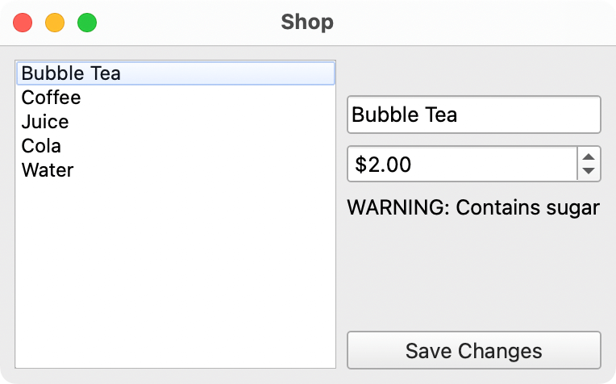
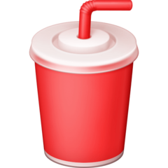

# Methods

If you have completed [Events and OOP II](https://matuadoc.co.nz/docs/graphical-user-interfaces/events/events-and-oop/), you should have a program that looks like this:



If not, please go back and complete that task. Or, ask your teacher for the sample code to work from instead.

## Adding methods

So far, you have created a ``Product`` class, kept track of a collection of ``Product`` objects, and modified the ``Product`` objects whilst the program was in use.

In this lesson, you will add methods to your objects.

> These should be independent from the property and setter methods.

A simple method to add: a method to save the product's name and product price.

```python
@dataclass
def Product:
    _name: str
    _price: float

    # Getters and setters here
    # …

    def set_new_name_and_price(self, new_name: str, new_price: float) -> bool:
        """
        Sets the new name and price from the GUI.
        Returns:
          - True if successful
          - False if nothing needs changing,
        Raises a ValueError if an invalid value is supplied.
        """
        # Check if the name has changed
        if self.name != new_name or self.price != new_price:
            self.name = new_name
            self.price = new_price
            return True   # Change completed successfully
        else:
            return False  # No change needed
```

This method can be called in the signal function — and since it returns ``True`` when the values are edited or ``False`` when they aren't, we can use this information to selectively decide whether to display a message box.

```python
def save_changes_button_clicked(checked: bool):
    # Get the value from the QLineEdit and QDoubleSpinBox
    new_name = name_lineedit.text()
    new_price = price_spinbox.value()
    
    # Get the current row from the list to know which object to edit
    product_index = product_list.currentRow()
    product = products[product_index]
    
    # Edit the price. Use try/except because it could raise ValueError
    try:
        did_set = product.set_new_name_and_price(new_name, new_price)
        # Only show the message box if it 
        if did_set:
            QMessageBox(QMessageBox.Icon.Information, "Price saved", "The new price has been saved").exec()
    except ValueError:
        QMessageBox(QMessageBox.Icon.Critical, "Error", "Error: could not set new values.").exec()
```

# Tasks

## Task 1

1. Implement the ``set_new_name_and_price`` method from the example above in your own code

## Task 2

1. create a class called ``ProductList`` with the following members/properties/methods:

| | Type | Member | Property | Setter | Method |
| :-- | :-- | :-: | :-: | :-: | :-: |
| products | list of ``Product`` objects | ✅ | ✅ | ✅ | |
| product_names | returns a computed list of ``Product`` name strings | | ✅ | | |
| update_list_widget | | | | | ✅ |

2. the ``product_names`` property does **not** reflect a member. It just returns a list of the names of the products in the ``products`` list
    - you already have a one-line snippet of code that does this supplied from [the previous lessons](events.md)
3. the ``update_list_widget`` method accepts a ``QListWidget`` as a parameter and updates it. You can then use this method to update the list whenever a product name is updated

## Task 3

Save the following images to the same folder as your code is located:

| long-black.png | flat-white.png | orange-juice.png | coke.png | fanta.png | water.png |
| :-: | :-: | :-: | :-: | :-: | :-: |
|  |  |  |  |  |  |

## Task 4

1. add a property method to your ``Product`` class called ``pixmap_filename`` which returns a string
2. this method returns the name of the product in all lower case with spaces replaced by dashes followed by ``.png``
    - for example: ``Orange Juice`` becomes ``orange-juice.png``

## Task 5

1. add a ``QLabel`` widget to your code called ``picture_label``
2. add a method to your ``Product`` class called ``load_photo`` with the following code:

```python
# Put this at the top of the file
import os


def load_photo(self, label: QLabel):
    """Displays the photo in the label"""
    # Load the path to the Python file, where the pictures are
    path = os.path.dirname(os.path.abspath(__file__))
    pixmap = QPixmap(os.path.join(path, self.pixmap_filename))

    # Show the picture in the label
    label.setPixmap(pixmap)
```

3. in the code that updates the label when a list item is picked, call the ``Product`` object's ``load_photo`` method (passing in the ``picture_label`` as the first argument)