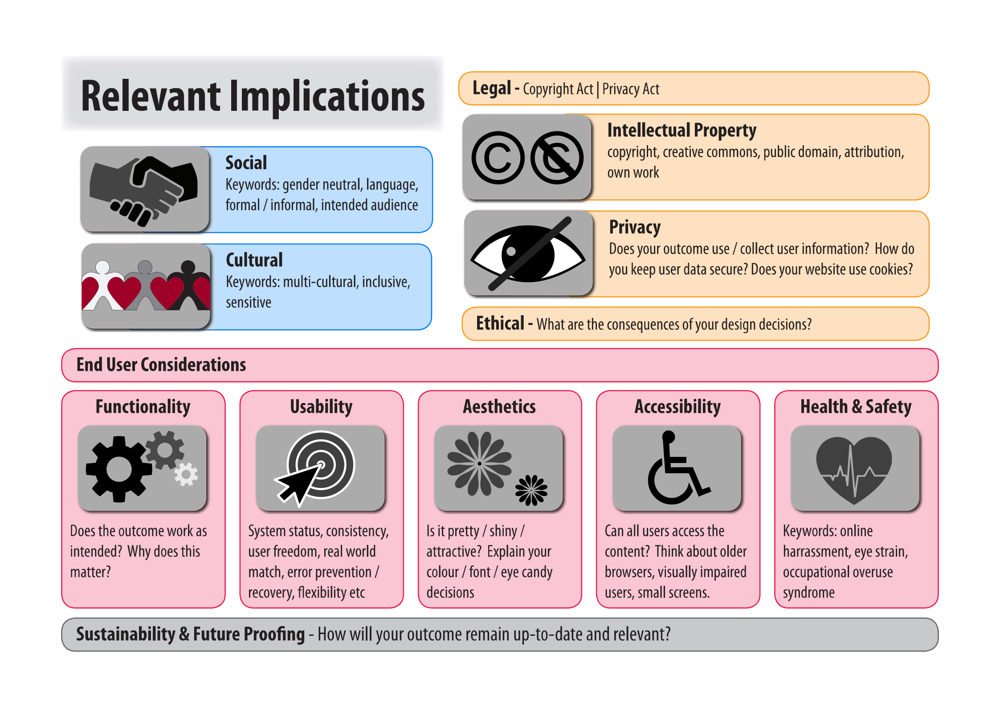

When discussing a technological outcome's implications, it means thinking about all the aspects that make an outcome suitable for the audience in various ways.

For example, a website isn't made just for the person who makes it — it's made for a specific [purpose and end users](purpose.md). Therefore, we must consider questions such as:

- is the thing we create socially acceptable for its audience?
- will differently-abled people be able to use the website?
- will a novice understand how to navigate it?
- do we respect people's privacy and intellectual property?

# List of implications

The following bullet points contain the implications, taken directly from the achievement standard, with example questions to help you consider whether or not these are **relevant** to your outcome.

## Social

A digital outcome can affect different social groups in different ways. Social groupings can be considered in terms of ethnicity, age, gender, religious beliefs, socio-economic status, and more. You need to ensure your digital outcome avoids offending anyone, mis-representing a social group or stereotyping people. Your outcome should appeal to all social groups, if possible. It should also be appropriate for the organisation it represents and for the target users.

Here are some questions to consider:

- How does this outcome fit into society?
- Does it meet any societal needs?
- How do people relate to the outcome?
- How does it relate to people?

**Watch**: This video will get you started in your thinking - it talks about the impacts that smartphones are having on society.

<iframe width="560" height="315" src="https://www.youtube.com/embed/_ANXYDYk36k" title="YouTube video player" frameborder="0" allow="accelerometer; autoplay; clipboard-write; encrypted-media; gyroscope; picture-in-picture" allowfullscreen></iframe>

## Cultural

Will all cultures be treated fairly by your outcome? If you use other languages, ensure they are used appropriately and use the correct spelling, including macrons for Māori text? If you are using imagery from a minority culture, are you doing so respectfully? Will your outcome show or say anything that is offensive in some cultures? Obtaining feedback from people of different ethnic backgrounds to yourself can provide unexpected insights.

Here are some questions to consider:

- Is the outcome culturally appropriate?
- Does it meet the needs of a culture/cultures?
- Which cultures? Te ao Māori? Other cultures?
- Do the specifications contain any cultural biases? Have these been identified and negotiated with the stakeholder(s)?
- If you have identified cultural biases, have you addressed these?
- Does your content contain any cultural artefacts? Images, video, audio, text in another language

## Legal

Will your outcome obey all relevant laws? These might include the [Privacy Act](https://www.consumer.org.nz/articles/privacy-law#article-what-the-act-covers), the [Copyright Act](https://www.copyright.co.nz/understanding-copyright/what-is-copyright), or [Harmful Digital Communications](https://privacy.org.nz/further-resources/knowledge-base/view/299) laws. For example, make sure your digital outcome doesn’t make false allegations, denigrate a person’s ethnic origin or sexual orientation, contains no private information and contains no intellectual property that you don’t have permission to include.

Here are some questions to consider:

- Does the outcome meet all necessary legal requirements?
- In what way does it meet legal requirements?
- Which legal requirements? Which laws?

## Ethical

Is it moral? Is it right? As designers and developers, it’s important that our products don’t cause harm to anyone. Make sure that your digital outcome doesn’t exploit users, encourage irresponsible choices, and isn’t violent or pornographic.  
 
Another ethical implication is ensuring that you only claim your original work as your own, crediting the owner or author of any other content.

Here are some questions to consider:

- What ethical considerations are relevant to the outcome?
- Is the outcome designed in an ethical way?
- Does the outcome meet ethical standards?
	- For the stakeholders? End user expectations?
- Where the outcome might need to do or present something whose ethics are difficult to define, is this accounted for?
	- In the brief?
	- In the design?
	- Some user-facing way? i.e. disclaimer, notice, confirmation page
	- Only available to some subset of end users?

## Intellectual property (IP)

Intellectual property refers to the ownership rights that people have over items, designs or ideas that they create. It can apply to a musical score, an idea, a painting or photo, code snippets, choreography, writing, and much more.  
 
The parts (images, text, code snippets, shapes, sounds, designs) you use to make up your digital outcome may come from a variety of different places - you need to ensure you aren’t breaching anyone’s intellectual property rights by using their work in your digital outcome without permission. For example, if you used a photo from pixabay on your website and its copyright conditions are ‘Free for commercial use No attribution required’, this means you are allowed to use it and don’t need to attribute the owner of the image on your website.

Obtaining your image from a Google image search filtered for ‘Labelled for reuse’ is NOT enough evidence that you are addressing copyright - you need to check the actual image website and find the copyright notice that allows you to use the image. Google’s image search algorithm is not 100% accurate regarding copyright. 
 
It’s important to know what the following terms mean:
 
- **Attribution** (BY) - Users of the work must credit the original author 
- **Non-commercial** (NZ) - Users may not make money from the work 
- **No derivatives** (ND) - Users may not remix or alter the work 
- **Share alike** (SA) - Users must share the work under the same license 
- **Public Domain** (CC0) - Anyone can use the work in any way

Here are some questions to consider:

- Does the content of the outcome belong to the owner?
- To the developer?
- Have you received permission to use certain content?
- Does your outcome adequately acknowledge other peoples' IP?

**Watch**: learn about Creative Commons licences with this short video.

<iframe width="560" height="315" src="https://www.youtube.com/embed/AeTlXtEOplA" title="YouTube video player" frameborder="0" allow="accelerometer; autoplay; clipboard-write; encrypted-media; gyroscope; picture-in-picture" allowfullscreen></iframe>

## Privacy

As digital designers, we often have access to other people’s data, images or personal information. There are strict laws governing the storage and use of personal information in NZ. [Read more about the 12 principles of NZ’s Privacy Act](https://www.consumer.org.nz/articles/privacy-law#article-what-the-act-covers). 
 
Think about how you will keep other people’s personal information safe and confidential. For example, if you are using images of other people in your website, do you have their permission? If your database contains private addresses, are these kept hidden from other users?

Here are some questions to consider:

- Does the outcome store or use any private data?
- Private to whom? Users? Company? Organisation?
- Does the outcome respect user privacy? How?
- Does it conform to the Privacy Act (if needed; see also Legal)?
- What mechanisms are in place to protect private data?

## Accessibility

When we make a digital outcome we should ensure most users can access it. This includes people who need to use different screen-sizes or devices, people with impaired vision or hearing, and any other group in our community that may have accessibility needs.

> “The UN Convention on the Rights of Persons with Disabilities, which New Zealand has ratified states that we must recognise "the importance of accessibility to the physical, social, economic and cultural environment, to health and education and to information and communication, in enabling persons with disabilities to fully enjoy all human rights and fundamental freedoms." (Be. Accessible)

Some examples of ways you can ensure you are addressing accessibility implications in your outcome might be: 
- the buttons on your phone app are large to help people who have fine-motor control or joint mobility problems to touch easily 
- colour schemes on your game that allow your text and images to be clearly seen by colour-blind people 
- your site uses proper semantic markup to allow individuals to non-visually understand the page structure and hierarchy. This also enables assistive technology devices to navigate to section headings and document landmarks on the page. 
- the print on your pamphlet is large enough to be readable to people with poor eyesight 
- you used alt tags and image descriptions on your website 
- you included a way for users to change the language in your game 

Here are some questions to consider:

- Can people with accessibility needs use the outcome?
- Are there specific features built for the needs of users with accessibility needs?
- What tools have you made use of in order to make the outcome accessible?

**Watch**: short video from NZ organisation Be.Accessible which explains why accessible design is important to our communities: 

<iframe width="560" height="315" src="https://www.youtube.com/embed/RyqMjFgi5Vs" title="YouTube video player" frameborder="0" allow="accelerometer; autoplay; clipboard-write; encrypted-media; gyroscope; picture-in-picture" allowfullscreen></iframe>

## Usability

While designing your digital outcome you will think about what your users need to do and how to help them do this. For example you may consider how the user inputs text into a text box and whether you can make this easy for them using prompts and a large, visible input box.   
 
In year 11 you may have learned about human-computer interaction(HCI) and usability heuristics. These are ideas and ‘rules of thumb’ you can follow to make the use of your outcome easier for users. If you need a refresher or you didn’t learn about this last year, please make use of the information and activities available in the [CS Field Guide](https://csfieldguide.org.nz/en/chapters/human-computer-interaction/usability-heuristics/), or ask your teacher to register you for the DT & HM Online HCI module.

Here are some questions to consider:

- Is the outcome intuitive?
- Would a person seeing it for the first time be able to figure out how to use it?
- How have/will you test(ed) usability?
- What paradigms or methodologies for measuring usability have you used?

## Functionality

You will need to think about how well your outcome will do what it is supposed to do, and what you can do to ensure that it functions as intended. This could include how fast a website loads, whether there are bugs in your code, or whether your outcome works on all devices. It’s good to think about specific things when you are investigating the functionality of your digital outcome.

For example, rather than just deciding it functions well, you can be more specific and say that the links work, or the error messages explain the problem clearly and ask the user to try again, or the database query displays the correct results, or that the images are clear and in proportion.

Here are some questions to consider:

- How does the outcome work?
- Does the outcome's functionality match the brief/specifications?
- Is the functionality discoverable, intuitive (see also [Usability](#usability))?
- In what ways does the outcome match the specifications for functionality?

## Aesthetics

Aesthetics is all about the look and feel of your outcome. When you design a digital outcome, it helps to be aware of design conventions for the type of product you are making and what you can do to ensure that it appeals to your target audience. It is good if you can recognise and explain what it is that makes an item attractive.

You may be able to conduct surveys among your target audience to gather evidence about how you can create an aesthetically pleasing product.

You may want to meet aesthetic requirements by using a harmonious colour scheme, designing balanced layouts, and using a particular font to support the style of your product.  

Here are some questions to consider:

- Is the outcome visually appealing? For whom? Stakeholders? Target end users?
- Do the aesthetics conform to a desired specification?
- Does the outcome integrate aesthetically with existing outcomes?

## Sustainability and future proofing

Isn’t it annoying when we need to buy a new phone because the old one won’t run the latest and coolest apps? It’s not much use designing items that are no longer usable a year later (although manufacturers and shopkeepers might disagree!).

It’s important to design products that can be kept up to date. If your outcome is software, you should arrange the code in such a way that changes and updates can easily be made by other programmers later on. Code comments will help other developers understand and edit your code in the future. If it’s a website you might want to set your menu up in such as way that you can easily add pages later on. Using current coding languages and conventions is another way of future-proofing your outcome.

Here are some questions to consider:

- Is the outcome robust, usable in future or able to be repurposed?
- What provisions have been made for future reuse/repurposing?
- How long is the outcome expected to be used?
- What is the outcome's potential shelf life?
- What tools or technologies did you select to ensure the outcome is sustainable or future-proofed?

## End-user considerations

The most beautiful outcome in the world is no use if it doesn’t meet its purpose because your users find it difficult to use! Think about how to ensure that your outcome does what the user needs.

Here are some questions to consider:

- Does the outcome use language at a suitable reading level for your users?
- Does the outcome appeal to the right demographic?
- Is the outcome available on the devices that your target audience uses?
- Is the outcome easy for the intended end users to operate?
- Is there any aspect of the outcome that could impact the health and/or safety of an end-user?
- What health and safety risks have you identified?
- How have you mitigated health and safety risks relating to this outcome?
- Does the outcome conform to the Health and Safety Act (if relevant; see also [Legal](#legal))?

## Health and Safety

Think about how you can make sure your outcome will be free from anything that could potentially harm your users. For example, a 3D-printed item with small parts that could come loose is not safe around babies. A website should be free from any text that encourages users to do anything dangerous or unhealthy. Mental health is an important aspect of health and safety. Think carefully about text and images in your outcome, and if in doubt check it out with an expert.

# Determining which implications are relevant

Looking through the implications above, ask yourself the question in relation to the outcome you are building.

Do the answers to those questions relate to:

- the requirements outlined in [the Task](task.md)?
- the purpose and/or end users?

For the assessment, you must identify, describe, ensure your design meets, and ensure your outcome *addresses* the implications.

## Describing the implications

 To describe an implication, you should 🟥 cite an established definition, 🔶 link the implication to the requirements/purpose/end users, then 🟢 state how your design and outcome will address the implications.

 For example:

 - 🟥 **Definition**: One thing I need to think about when designing a website is accessibility. Accessibility means "is about inclusion — making sure everyone, including disabled people and those using assistive technologies, can access online information and services" (https://www.digital.govt.nz/standards-and-guidance/design-and-ux/accessibility/)
     - This section cites the definition from digital.govt.nz and provides a link to where the definition was found.
     - Make sure to cite the actual website or book where you find the definition, not simply a search page.
 - 🔶 **Link**: It is important to consider accessibility for my website because students at Onslow College may have specific accessibility needs (low vision, reading difficulties) but want to access the content on my website.
     - This section links the accessibility implication to an end user group, students at Onslow College.
 - 🟢 **Addressing**: I will try to make my website accessible by using clear and easy to read fonts at sizes that are comfortable for low-vision users. I will also use colours that are suitable so that the text can be easily read against the background colour.
     - This section explains how the design will ensure that the website is accessible.

# Activities

## Activity 1

For the following project description, 🟥 define, 🔶 link, and 🟢 address the following implications:

- privacy
- intellectual property

You are to create a website that allows Onslow College coaches to upload photographs of sporting events, tag the students, and post scores. This will allow students, whānau, and the wider community (including competing schools' coaches, students, etc.) to follow how the school is doing.

## Activity 2

For the following project description, 🟥 define, 🔶 link, and 🟢 address any relevant implications:

A chess game is being developed that allows the user to play against a computer. The developers plan on using code from another chess game to help create the AI opponent. The game will be presented in monotone (black and white) as a stylistic choice.

# Task

Identify **at least two** (2) relevant implications for your project, its requirements, purpose, and end users. Then 🟥 define, 🔶 link, and 🟢 address them in your portfolio.