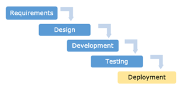
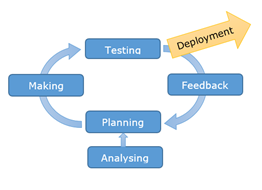
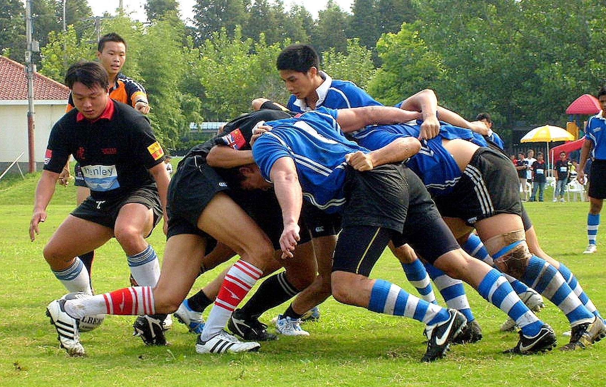

# Project management

Project management is about how you organise yourself and your time throughout your project. In industry, projects tend to be a lot more complex than they are at school, and project management is vital. There are many ways of managing projects — a very popular system in the software industry today is **agile development**. 

If you have already decomposed your project and planned your time, you have done a large part of the project management already. The next part is organising yourself while you work. Some common techniques are described below.

# Methodologies

## Agile development

Agile development arose as a result of the fast-paced software development environment and a need for businesses to move quickly and efficiently.

The big ideas are:

- following dynamic process that adapts quickly to changing requirements
- following an **iterative** development cycle with **incremental** delivery of components rather than trying to deliver right at the end
- work in self-managing teams with involved stakeholders where everybody works towards one goal
- incorporate continual feedback, improvement, planning, and learning

<iframe width="560" height="315" src="https://www.youtube.com/embed/ZZ_vnqvW4DQ" title="YouTube video player" frameborder="0" allow="accelerometer; autoplay; clipboard-write; encrypted-media; gyroscope; picture-in-picture" allowfullscreen></iframe>

> Stop the video at 2:18

## Waterfall methodology

A more traditional style of development is the waterfall, where each step trickles down to the next — but never returns back to the previous step. Waterfalls go down, not up — it's a one way trip.

Compare the sequence of steps in the traditional waterfall methodology to agile:

| Waterfall | Agile |
| :-: | :-: |
|  |  |

This means that the process is set out at the start of a project and never modified. If the project requirements ever change, the waterfall methodology cannot deal with this — accounting for any changes will have to wait until the whole process starts over again, meaning that the deployed product will *definitely* not meet those new requirements.

<iframe width="560" height="315" src="https://www.youtube.com/embed/idDtKI8GM-A" title="YouTube video player" frameborder="0" allow="accelerometer; autoplay; clipboard-write; encrypted-media; gyroscope; picture-in-picture" allowfullscreen></iframe>

> Stop the video at 2:31

# Scrum

Scrum is a framework, or a set of processes, that can be followed to **manage** a profile in an angile manner. It is named after a rugby scram, emphasising the need for a team to work together towards a common goal.

In many businesses, a strict scrum framework is followed, but in others the model is adjusted to suit the team and the project.

In a school setting, you could use the following parts of the scrum framework to help you work in a more agile manner.

## Product backlog

This is a list of tasks required to complete a project. You would select a few tasks from this list to work on at a time, rather than trying to work on everything at once.

> For example, think about the Onsflix program. You could decompose the project down to (1) adding movies (2) editing movie run times (3) deleting movies, and (4) listing movies — each of these would exist in the product backlog.

## Working in sprints

In agile and scrum, work is divided up into short sessions called **sprints**.

In industry a sprint usually has a duration of 2 weeks. At the start of the sprint the team selects a small list of tasks or features from the product backlog, and focuses on completing these tasks by the end of the sprint

This iterative process means that the product is being improved and tested regularly in short cycles, rather than only at the end.

One benefit of sprints is that at any time the team is working on a  limited number of tasks, making them more focussed and efficient. Although the main planning meetings happen at the beginning and end of each sprint, quick daily meetings called ‘stand-up’ or scrum meetings are also held.

## Daily scrums

Daily scrums are a way of checking in quickly each day to share progress with other members of the team and to move tasks across the project board. The development team huddles together to focus on:

- progress being made towards the sprint goal
- what is blocking progress

These are also called 'stand-up meetings'. The ‘stand-up’ aspect of these meetings is designed to keep them **short**! There should be no discussion or updating of the [project board](#project-boards); that can be done later after the scrum is over.

If you are working alone on your outcome development project, instead of a meeting you could set 5 minutes aside to update your planning and review your tasks every day before you start working on your code.

## Retrospective

At the end of each sprint is a good time to reflect and talk with others in the team about what co-operative strategies worked well and what could be improved for the next sprint.

It’s also a good time to update your planning. This is when you would:

- complete any testing and trialling before starting the next sprint
- based on the testing and trialling, refine your backlog (strip out any unnecessary components, add in others that were determined during your sprint)
- determine what components need to be worked on next