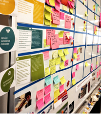

Project boards are methods of displaying the tasks you need to do. They are also called kanban boards (from the Japanese 看板, meaning 'signboard').

<iframe width="560" height="315" src="https://www.youtube.com/embed/jf0tlbt9lx0" title="YouTube video player" frameborder="0" allow="accelerometer; autoplay; clipboard-write; encrypted-media; gyroscope; picture-in-picture" allowfullscreen></iframe>

This visual method of displaying the status of tasks is usually a table (whiteboard, paper, online) divided into columns, with a way of moving tasks between the columns (sticky notes, text boxes, online notes).

Having a visual planner such as a project board helps everyone on the team easily see what is going on, encouraging focus and teamwork. A project board is equally useful if you are working alone on your project.

## Columns and limits

A simple version uses columns such as:

- Backlog
- In-Progress
- QA (or Testing)
- Complete

For each column, specify a maximum number of components. For example, you could state that in a single sprint, you should work on no more than two components at a time.

Defining a limit like this prevents you from overloading your plate and making your sprint unmanageable.

| Backlog | In-Progress (2) | QA (2) | Complete |
| :-- | :-- | :-- | :-- | :-- |
| |

## How to build a project board

| Tool | | Description |
| :-- | :-: | :-- |
| Whiteboard |  | If you have a safe space in the classroom, you could use sticky notes and a whiteboard to organise your project. Having it public will keep it forefront in your mind! |
| Online |  | There are many online tools such as [Microsoft Planner](https://planner.office.com/), [GitHub Projects](https://docs.github.com/en/issues/organizing-your-work-with-project-boards/managing-project-boards/creating-a-project-board), [Trello](https://trello.com), [Padlet](https://padlet.com) |

Here's a tutorial video for Microsoft Planner, which comes free with your Microsoft 365 subscription provided by the school:

> Note: start at 1:02 — **DO NOT** use Planner with Teams. Go to [Microsoft Planner](https://planner.office.com/ instead)

<iframe width="560" height="315" src="https://www.youtube.com/embed/y2w4nduCop0?start=62" title="YouTube video player" frameborder="0" allow="accelerometer; autoplay; clipboard-write; encrypted-media; gyroscope; picture-in-picture" allowfullscreen></iframe>

Here's a tutorial video on how to create a project board with GitHub Projects, which you can associate with a GitHub repository that you create:

<iframe width="560" height="315" src="https://www.youtube.com/embed/YVFa5VljCDY" title="YouTube video player" frameborder="0" allow="accelerometer; autoplay; clipboard-write; encrypted-media; gyroscope; picture-in-picture" allowfullscreen></iframe>

## Game

Try the [Kanban Board Game](http://www.kanbanboardgame.com).

You will manage members of a team by assigning them to components on a project board. Each component requires a certain amount of analysis, development, and testing. How much money can you make for the company with good project management?

> You will need to sign up for an account. Use your school email address.

# Reminders 

Once you get moving on your project you may find it hard to remember to pause and reflect. No matter what system you choose for managing your project, you need to ensure you build in regular points at which you do the following:  

- updates to your planning
    - if you are working in sprints, the last task in each sprint might be to check milestones and update planning. 
- testing and trialling of components
    - if you are using a Trello type of tool, the last task on each checklist might be ‘test’. 
- review relevant implications
    - in your evidence for this assessment you need to explain some wider implications that are relevant to your outcome, and show how you addressed these. It is easier to do this as you go, so you should build reminders into your planning system. 
- collect evidence for your assessment
    - you need to gather evidence showing that you used a selection of appropriate project management tools and techniques. Set up reminders for yourself — at the end of each sprint or at each milestone might be appropriate places to take a screenshot showing the current version of your project board and paste it into your evidence document.  