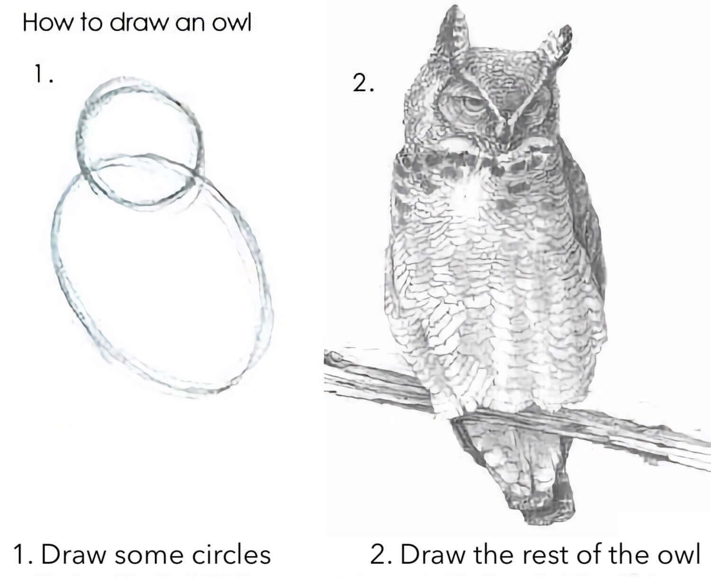
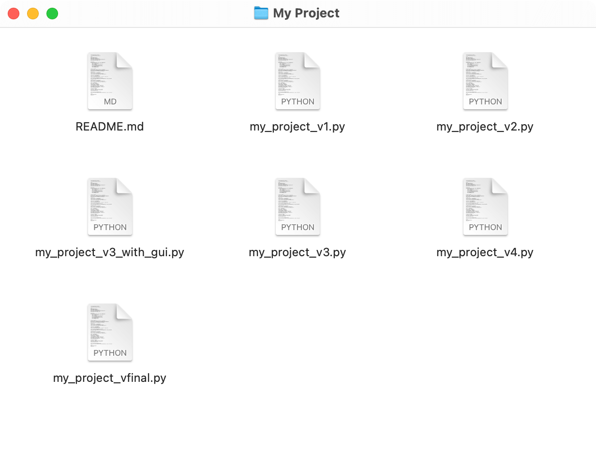
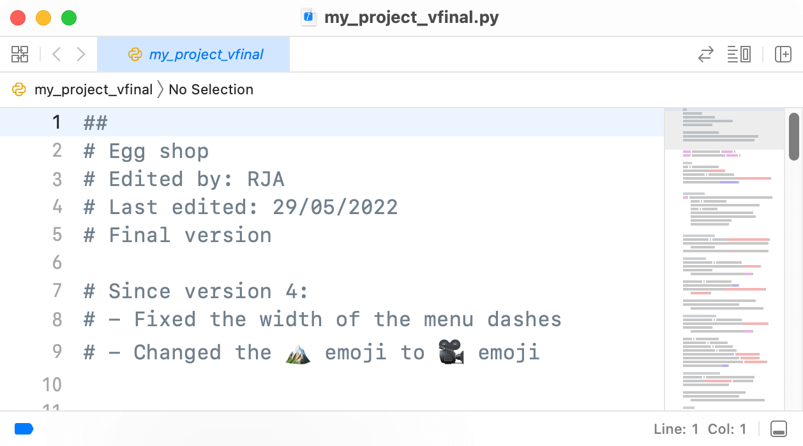
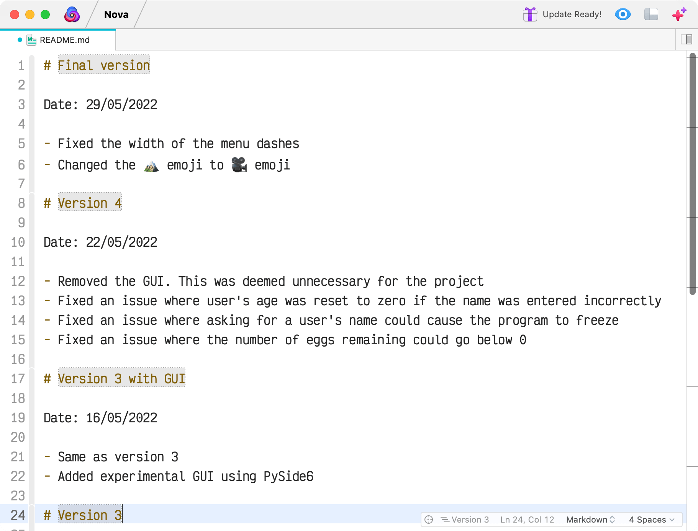
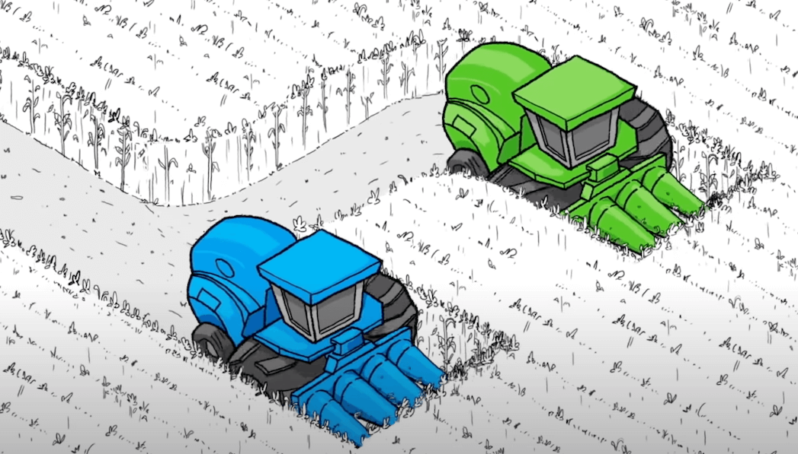

When you work on a project, things don't go right the first time around. Drawings, like software development projects, don't go from concept to final product like this…

If you were drawing a picture, you're likely to:

- sketch up the basic outlines
- go back, tidy up some lines
- add some details
- erase the mistakes
- redraw the lines
- etc.

When we make digital items it’s the same - we don’t usually make the whole thing all at once and get it right the first time.

As you develop your outcome, it is important to save versions of your work to show its development over time. This also makes it easier if you find something doesn’t work and you need to revert to an earlier version — *or erase some lines and draw them again*.

There are two main ways to save versions of your work.

# Easy way: saving versions of your work

A very simple way is to create separate copies of your work. This way, if you find issues with your outcome, you can easily revert to one of those previous versions by switching while file(s) you edit, retrieving a file you had deleted, etc.

Good times to create new versions include:

- at the end of a sprint
- on a regular basis (every couple of days, every week, etc.)
- when you implement a component
- when you fix a major bug

You could put the different versions of your work into separate folders, or even compress them into a ZIP archive. Be sure to:

- give the folders/archives names to indicate their version
- add some kind of description to state what differs from the previous version
    - this could be a comment in your code
    - 
    - or a document containing an explanation, such as a ``README``
    - 

# Other way: git

A common way of managing files in programming projects is using a free and open source tool called [``git``](https://git-scm.com), which is a distributed version control system.

At Onslow College, this tool is combined with an online service called [GitHub](https://github.com/), run by Microsoft. GitHub provides a place to store your files, along with other useful tools such as [project boards](./project-boards#how-to-build-a-project-board).

Watch this brief video on how GitHub works for developing a program in a team:

<iframe width="560" height="315" src="https://www.youtube.com/embed/w3jLJU7DT5E" title="YouTube video player" frameborder="0" allow="accelerometer; autoplay; clipboard-write; encrypted-media; gyroscope; picture-in-picture" allowfullscreen></iframe>

> Note: of course, you will be working on your project individually. That said, you can still make use of the tracking features for version control **and** issues/discussion for [trialling](trialling).

## Repositories

You can create a **repository** (or repo) on GitHub for your project. A repository is a place where all the files for your project are stored — you can [commit files](#commits) to your repository.

Once you have created the repository on GitHub, you can **clone** it to bring the files to your own computer. You would then commit and push the files to GitHub.

You can also clone other repositories on GitHub. You've already done this with your programming assignments.

Git downloads the repository to a specified folder. That folder is called the **working directory** and contains all the files you edit. The actual repository itself is stored in a hidden folder (called ``.git``) and is called the **local repository** or **HEAD**.

## Commits

When you make changes to the code in your working directory, you **stage** the relevant files. You can stage just one file or many, it's up to you — the files you stage should represent the minimum number of files needed for a given change in the code.

Once the files are staged, they are marked as ready to be recorded as a **commit**.  A commit is like a separate version of the project within your code; the staged files contain the changes, making it clear what you edited.

With each commit, you add a commit message that explains the changes you have made to your code. [Learn to write good commit messages](https://medium.com/compass-true-north/writing-good-commit-messages-fc33af9d6321).

Once committed, you can **push** the commit to GitHub. When you do this, any commits in your local repository that you've made since your last push are sent to the **remote repository**. They are uploaded to GitHub!

Now your commits are backed up so that you won't lose any of your versions!

Since each commit saves a copy of your code at the time you committed, you can **revert** back to a previous commit in case you want to undo a mistake.

> You can also browse all of the versions of your code on GitHub if you just want to take a look at something.

If you pushed code to your GitHub repository from one computer (i.e. your laptop) and need to access it on another computer (i.e. a school machine), you **pull** the code from GitHub.

⚠️ If there are newer commits on GitHub than in your **working copy** (the version of the project on your computer), then you must pull from GitHub first before you are allowed to push.

[Click here for non-animated version](img/versions_workflow.png)

## Branches

Another useful feature of ``git`` is creating **branches**. These are like commits, except that they are complete copies of your project that you can use for testing new features.

Every repository is equipped with a default branch called ``main`` (in older projects, it was called ``master``).

You can create copies of ``main`` with a name that you specify. For example, if you have code that presents a menu in one way, and you want to trial a different way, you could create a branch called ``alt_menu`` or something similar.

Each branch has its own local repository within the hidden ``.git`` folder; this is what keeps the changes separate. Therefore, you need to be careful to select the branch to which you want to commit — you might accidentally commit code to the ``main`` branch then get confused as to why there is nothing to push to your new branch!

When you are happy with the code and wish to make it available to the ``main`` branch, you can **merge** your other branches back into ``main``.

## Glossary

[Read the project management glossary](/classroom/glossary#project-management).

## Resources

### More about Git

- [Git official website](https://git-scm.com)
- [freeCodeCamp: Learn the Basics of Git in Under 10 Minutes](https://www.freecodecamp.org/news/learn-the-basics-of-git-in-under-10-minutes-da548267cc91/) — focused on using git commands, suited to macOS and Linux

### Videos

- [Git, GitHub, and GitHub Desktop for beginners](https://www.youtube.com/watch?v=8Dd7KRpKeaE)
- [Learn Git in 15 Minutes](https://www.youtube.com/watch?v=USjZcfj8yxE) — focused on using git commands, suited to macOS and Linux

### Git and Visual Studio Code

- [Working with GitHub in VS Code](https://code.visualstudio.com/docs/editor/github)
- [Using Git with Visual Studio Code: The Ultimate Guide](https://yourbrainoncomputers.com/using-git-with-visual-studio-code-the-ultimate-guide/)