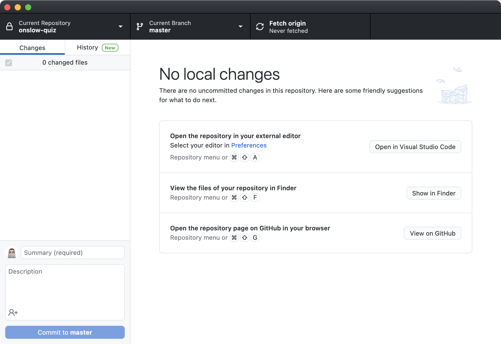
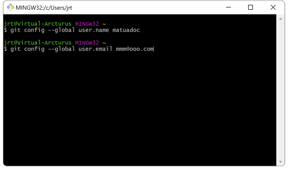

# 1. Getting started with GitHub

## 1.1 Create a school GitHub account

To participate in GitHub Classroom, you will need to [sign up for school GitHub account](https://github.com/signup) with with your school Microsoft account.

## 1.2 Join a GitHub Classroom

When you first accept an assignment from a task on this website, you will be asked to select your name from a list of student names. Please click on yours to associate your GitHub account with the details in GitHub Classroom.

# 2 How to use Git

## 2.1 Downloading code from GitHub

### 2.1.1 In Visual Studio Code, using GitHub Classroom

1. Click on the  GitHub tab
2. If you have not yet signed in to GitHub Classroom, click the Sign In button
3. You will see a list of assignments that you have accepted
  - Hover the mouse pointer over the assignment you wish to open, then click the folder

### 2.1.2 In GitHub Desktop

If you have problems downloading assignments via GitHub Classroom, use [GitHub Desktop](/classroom/setup.html#32-install-github-desktop).



1. If you are opening GitHub Desktop for the first time, sign in
2. Your repositories are shown on the right. Click one, then click Clone
3. After your repository has downloaded, click the Open in Visual Studio Code button
   - If you can't find this button, click on the Repository menu

If a repository is already open:
1. Click on the Current Repository drop-down menu
2. Click on the Add drop-down menu
3. Click on Clone Repository…
4. Type the name of your assignment's repository. If it does not show, click on the Refresh button.
5. Click on the repository, then click Clone

### 2.1.3 In Visual Studio Code, manually

1. Click the File menu → Close Folder
2. Click on the  Explorer tab
3. Click on the Clone Repository button
4. In the command palette, copy-paste the URL that you copied in step 3

## 2.2 Commit work to GitHub

As you work on the code contained in the assignments, be sure to commit your code. This is a record of what you changed.

### 2.2.1 Set up your Git variables

1. Open a Terminal that can run ``git``
   - On Windows, open the Git Bash program
   - On macOS/Linux, open the Terminal app



2. Enter the following command, then press Enter/Return
   - ```bash
     git config --global user.name yourgithubusername
     ```
3. Enter the following command, then press Enter/Return
   - ```bash
     git config --global user.email "yourgithub@email.com"
     ```

### 2.2.2 Stage your changes

1. Click on the  Source Control tab
2. You will see a list of files with changes. To send them to GitHub, you need to **stage the changes** to commit. Click on the  Add button next to those files.

### 2.2.3 Add a commit message

- In the box that reads Message, click and type a **commit message** that sums up the changes you have made.
   - Commit messages start with a **subject**. This is a brief description of what changes you made. It is 50 characters or fewer and it does not end with a full-stop.
      - Add a blank line under the subject.
      - Any other comments you wish to make should be made here. Explain **what and why**, not **how**.
      - Example commit message:
         ```
         Fixed kumara total price calculation

         Previously, the kumara price was the item price multiplied by the quantity. I adjusted it to also account for GST.
         ```

### 2.2.4 Commit your code

1. After you have staged your changes and entered a commit message, click on the  Commit button.
1. There are two ways to push the commit(s) to GitHub:
   1. Click on the Sync Changes button (if it is showing), **or**
   2. Click on the  button then click Push.