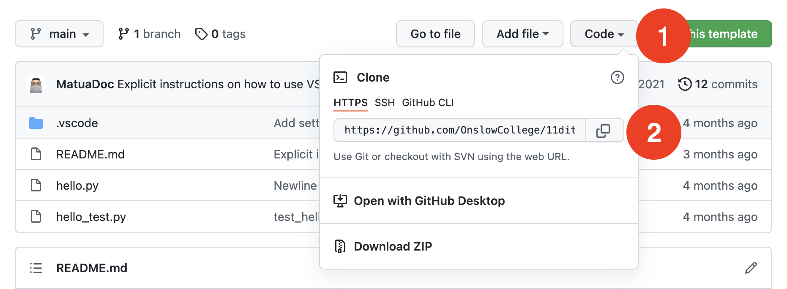

# Downloading code from Github

There are two ways to download code from Github into Visual Studio Code.

1. Using [Github Classroom](classroom.md)
2. [Manually, by checking out code via URL](#checking-out-code-manually-via-url)

## Checking out code manually via URL

### Copy the URL from Github

1. Go to [Github.com](https://github.com/)
2, In the Repositories section on the left, click on your assignment repository
3. Click on the Code button (1) and click the copy button (2)



### Check out the code in Visual Studio Code

4. Click the File menu → Close Folder
5. Click on the  Explorer tab
6. Click on the Clone Repository button
7. In the command palette, copy-paste the URL that you copied in step 3

# Commit your work regularly

As you work on the code contained in the assignments, be sure to commit your code. This is a record of what you changed.

## Set up your Github details

1. Open a Terminal that can run ``git``
   - On Windows, open the Git Bash program
   - On macOS/Linux, open the Terminal app
2. Enter the following commands

```bash
git config user.name yourgithubusername
git config user.email yourgithub@email.com
```

## Stage your changes

1. When you have written your commit message, click on the tick icon.
2. Click on the **…** icon and click Push. Your code will be sent to Github.

3. Click on the  Source Control tab
4. You will see a list of files with changes. To send them to Github, you need to **stage the changes** to commit. Click on the  Add button next to those files.
5. In the box that reads Message, click and type a **commit message** that sums up the changes you have made.

   - Commit messages start with a **subject**. This is a brief description of what changes you made. It is 50 characters or fewer and it does not end with a full-stop.
      - Add a blank line under the subject.
      - Any other comments you wish to make should be made here. Explain **what and why**, not **how**.
      - Example commit message:
         ```
         Fixed kumara total price calculation

         Previously, the kumara price was the item price multiplied by the quantity. I adjusted it to also account for GST.
         ```

## Commit your code

6. After you have staged your changes and entered a commit message, click on the  Commit button.
7. There are two ways to push the commit(s) to Github:
   1. Click on the Sync Changes button (if it is showing), **or**
   2. Click on the  button then click Push.