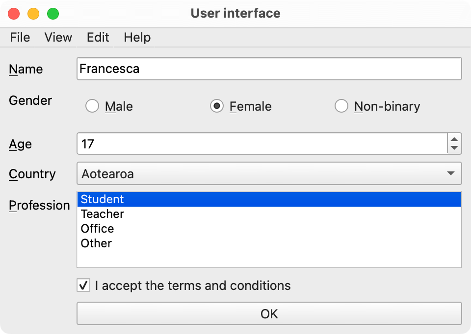

# Programming terms

## Access specifier

In most programming languages, a [keyword](#keyword) that defines if other parts of a program can access a specified piece of data (such as a [variable](#variable) or [constant](#constant)).

At the most basic level, something marked as public is accessible to every other part of a program. On the other hand, something marked as private is only accessible within a specified [scope](#scope), such as within a [class](#class).

Python does not have access specifiers. However, variables prefixed with an underscore (``_``) are implied to be private; however, Python does not enforce this in code but rather by convention. That is to say, Python developers know not to access or modify variables prefixed with an underscore, preferring to use [properties](#properties).

## Boolean

A value that represents logical truth — whether something is true or false.

In Python, this can be either ``True`` or ``False`` (note the capital letters).

## break statement

A [statement](#statement) that causes the program to exit the currently-running [loop](#loop).

## Casting

The process of converting data of one [data type](#data-type) to another. For example, numbers could be converted to text, integers to floating-point numbers, etc.

## Class

In [object-oriented programming](#object-oriented-programming), a class is a [data structure](#data-structure) that defines the template for creating [objects](#object) in [object-oriented programming](#object-oriented-programming).

A class [encapsulates](#encapsulation) the [state (members)](#member-variables), [access levels (properties)](#access-specifier), and [behaviour (methods)](#method). However, unlike an object, it only specifies the structure of dato; it does not contain any data itself.

Objects that are created based on a class are [instance variables](#instance).

## Code block

A sequence of lines of code that is grouped together. These are often used for a specific purpose, such as code that is run when a certain [condition](#conditional) is met or code that is run in a [loop](#loop).

In Python, a code block is indented by four characters. In other languages, brackets (typically ``{`` and ``}``) enclose code blocks.

Code blocks can contain other code blocks.

## Collection

A [data structure](#data-structure) that contains multiple [elements](#element). Most collections are also [iterables](#iterable) — but not always.

[Lists](#list) and [dictionaries](#dictionary) are examples of collection [data types](#data-type).

## Compiler

Software that compiles (converts) program code to an [executable](#executable) format to be run on the computer.

Code in certain program languages must be compiled. However, other languages (such as Python) run code using an [interpreter](#interpreter).

## Conditional

A [statement](#statement) that determines whether or not a certain value is equal to another value, especially [Boolean](#boolean) values.

An example of a conditional statement is the [if statement](#if-statement). A conditional statement also forms part of a [while loop](#while-loop).

Values can be described as the **left-hand side** and the **right-hand side**. When both sides are equal, the condition is said to be met. For example:

```python
x = 10

if x == 10:
    # Run some code
```

In this example, both the if statement's left-hand ``x`` and right-hand ``10`` are equal, so the condition is met.

## Data structure

A model of the relationship between data values (and sometimes behaviours) in a collection of data values.

## Data type

An attribute of data that tells the [compiler](#compiler) or [interpreter](#interpreter) how the programmer will use the data.

Most programming languages support basic data types such as numbers ([``int``](#integer), [``float``](#floating-point-number), etc.), text ([``str``](#string)), [collections](#collection) ([``list``](#list), [``dictionary``](#dictionary), etc.).

Some programming languages are very strict about how data of different types can interact. In many of these languages, it is necessary to declare every [variable] and [argument's] data type when they are created.

In Python, this is not necessary. However, you can optionally specify **type hints** as a form of [documentation](#documentation). 

```python
# Type hint for variables
x: int = 10
y: float = 0.2

# Type hints for arguments and return type
def my_function(arg_1: str, arg_2: float) -> bool:
    pass
```

You can also enforce type checking by installing ``mypy`` with ``pip``.

## Dictionary

A [collection](#collection) [data structure](#data-type) whose [elements](#element) are accessed via a key rather than an [index](#index). Each key may only appear once in a dictionary and is associated with an element; these are called key-value pairs.

Also called associative arrays, maps, hash maps, or symbol tables.

## Documentation

Textual, video, or audio material that describes or explains the code in a program.

Common forms of documentation within a program's code include [comments](#comments), [type hints](#data-type)

## Element

A piece of data that belongs to an [iterable](#iterable) or [collection](#collection). Collections typically contain multiple elements.

## Encapsulation

The bundling of [state](#member-variable) and [behaviour](#methods) into a single data structure.

## Expression

A segment of code that is [evaluated](#evaluation) to determine what value will result.

For example, the code ``1 + 2`` is an expression that evaluates to ``3``. Calling a [function](#function) and using its [return value](#return-value) is also an example of an expression.

## for loop

A [loop](#loop) that runs a code block for each item in an [iterable](#iterable), such as a [list](#list), [dictionary](#dictionary), or [range](#range).

The loop ends when each [element](#element) in the iterable has been used.

```python
for item in collection:
    print(item)
```

## Function

A [code block](#code-block) that contains a series of instructions to be performed on demand. The programmer can **call** the function at any point in the program to run that code block.

Functions can specify [parameters](#parameters). These are data that the programmer must enter when calling the function.

Functions can also calculate and [return values](#return-value) that can be used in other parts of the program.

## Graphical user interface

A form of user interface that allows users to interact with a program using on-screen graphics, including icons, [widgets](#widget), and sometimes audio.

Unlike text-based interfaces whose primary interaction method is via the keyboard, graphical user interfaces are also manipulated using a pointer (mouse, trackpad) or direct manipulation such as via a touch screen.

## GUI

See [graphical user interface](#graphical-user-interface).

## if statement

A [statement](#statement) that executes a [code block](#code-block) if a given statement evaluates as [true](#boolean).

In Python, this is written as:

```python
if condition:
    # Some code to run
elif condition:
    # Other code to run in a different circumstance
else:
    # What to run if no condition evaluates to True
```

## Index

A number describing an [element's](#element) position within a [collection](#collection). In most programming languages, collections are zero-indexed: this means that the first item's index is ``0``, the second item's index is ``1``, etc.

Indices are used to access [elements](#element) within a collection.

```python
collection = ["a", "b", "c", "d", "e"]
third_item = collection[2]
print(third_item)  # c
```

## Instance

In [object-oriented programming](#object-oriented-programming), an [object] created from a [class] is in instance of that class.

## Interpreter

Software that runs code in a support language one line at a time.

Code in certain languages support being interpreted, such as Python. Other languages must be [compiled](#compiler) before being run.

## Iterable

A [data type](#data-type) whose [elements](#element) can be returned one at a time when [iterated](#iteration) upon.

## Iteration

A [code block](#code-block) that is designed to be repeated a defined number of times. A [loop](#loop) is an example of iteration.

## Loop

A specific kind of [code block](#code-block) that is [iterated](#iteration) a certain number of times. See also [while loop](#while-loop) and [for loop](#for-loop).

## Method

A [function](#function) that is part of a [class](#class)/[object](#object).

Instance methods are called on an object, whereas class methods and/or static methods are called on a class.

The word 'method' can be used to differentiate functions that belong to classes/objects and those that do not.

## Object

In [object-oriented programming](#object-oriented-programming), an object is a [data structure](#data-structure) that [encapsulates](#encapsulation) the [state (members)](#member-variables), [access levels (properties)](#access-specifier), and [behaviour (methods)](#method).

Unlike a [class](#class), which is a template for an object, the object contains the actual data.

## Scope

The parts of a program where data or a function within a [code block](#code-block) is considered valid (and, by extension, accessible).

## Statement

A segment of code that denotes the explicit step that a program should carry out.

For example, an [if statement](#if-statement) allows the programmer to specify other statements or [expressions](#expression) to carry out if a particular condition is met.

## while loop

A [loop](#loop) that runs a [code block](#code-block) while a particular [condition](#conditional) evaluates as [true](#boolean).

The loop ends when the condition evaluates as false **or** the user explicitly [breaks](#break-statement) out of the loop.

## Widget

A visual element on a [graphical user interface](#graphical-user-interface) that provides a means for interacting with the user, either by presenting information or allowing the user to perform a task.



Examples of widgets include labels, buttons, check boxes, radio buttons, text fields/line edits, text areas, steppers/spin boxes, etc.